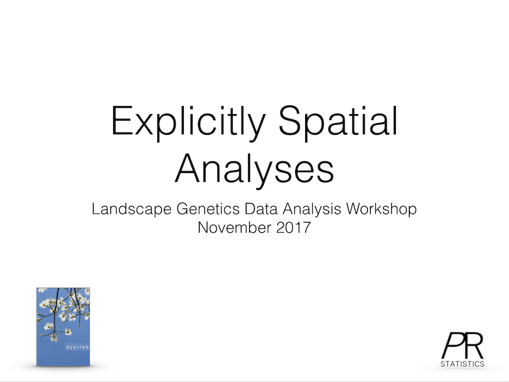

# Space & Networks


## Spatial Analyses

In addition to resistance modeling, there are several additional approaches we can apply while conducting *Landscape Genetic* studies.  In this lecture, we explore some of the more common approaches to determine how the inferences we gain from them may help us understand the processes that shape and maintain spatial and ecolgical genetic structure.

<div class="card">
<a href="Lectures/LG4_1_Spatial_Analyses/index.html" target="new">
  
</a>
</div>

<p>&nbsp;</p>


## Network Approaches

Given the equivallence of different mathematical systems, much of what we have been doing using distance matrieces can be generalized into Graph Theoretical contexts.  After all, a distance matrix is simply the algebraic equivallent of a network.  Here we explore some of the ways that networks have been applied to the genetic data we collect.

<div class="card">
<a href="Lectures/LG4_2_Network_Approaches/index.html" target="new">
  
</a>
</div>

<p>&nbsp;</p>


## Activity Synopsis

In this activity we explore two different topics, admixture & ordination approaches and network approaches, both of which are focuses on describing spatial population genetic structure. 

## Objectives 

This activity is divided between two different topics, explicitly spatial analyses of genetic structure and network approaches.  The objective here are to:

1. Understand admixture and how it can be used to identify natural partitioning in our data via methods like STRUCTURE and TESS.
2. Explore various methods of ordination salient to the analysis of genetic structure and partitioning in our data.
3. Learn about network manipulation and explore how genetic distance and population graph approaches may help describe spatial population structure.

## Admixture

Admixture is the mixing of two or more populations whose frequency spectra may differ.  If they differ considerably, then the admixed population may be examined to determine relative contributions of each population.

```{r admixture, echo=FALSE, fig.cap="Hypothetical pedigree of an individual whose parents come from two separate populations.  Stretches of chromosome are depicted in differing colors to highlight parentage as well as demonstrate admixture in the offspring."}
knitr::include_graphics("./media/Admixture.png")
```

An ubiquitous feature of modern population genetic analyses is the presence of a model-based clustering analysis such as those provided by programs such as STRUCTURE and TESS.  The general idea of these approaches is to examine the current distribution of genotypes ($X$) within individuals and populations and try to describe it in terms of historical mixing of populations ($Z$), at specified mixing rates ($Q$), whose allele frequency spectra ($P$) may differ.  

\[
P(X|Z,P,Q) = \prod_{i=1}^N\prod_{j=1}^LP_{z_{ij},\;p_j,\;x_{ij}}
\]

Estimating the particular values $Z$, $P$, and $Q$ (realized for each of the $N$ individuals across $L$ loci), has to be done numerically. This  process can provide some valuable insights to partitioning of your data.  However, if you data are distributed along a gradient, these approaches are not quite as powerful.
 
To use STRUCTURE, you need to reformat your data, either by hand or by exporting it through *gstudio*. The format for STRUCTURE requires that population designations to be  numeric values, alleles have to be encoded in a particular way, files need to be formatted in a particular way, etc.  Total pain.  However, we can do this in R as:

```{r}
library(gstudio)
data(arapat)
write_population(arapat, file="arapat_structure.txt", 
                 mode="structure", stratum="Population")
```

which will take your R `data.frame` with loci and other information in it and save it as a text file in the appropriate directory in the STRUCTURE format.  

You run STRUCTURE using either the command-line approach or via a GUI that comes with it.  Most people will prefer the GUI.  After starting it, do the following:

Create a folder for the project. For some reason the Java GUI that STRUCTURE uses disallows the creation of new folders on OSX (don't know if it does the same on windows). Put your data file (the `arapat_structure.txt` file from the previous code block) in that folder. 

Create a new project in STRUCTURE using $File \to New\;Project$:

Walk through the setup pages. The salient numerical information you will need is:  
- Number of Individuals: 363 
- Number of loci: 8
- Missing data value: -9

You should also check the following boxes:  
- Individual ID for each individual 
- Putative population origin for each individual

This should have you set up and ready to go. For an initial run through the data, you need to specify some parameters for the simulations. You do this by selecting $Parameter\;Set \to New$. 

The default values on the parameters are a good place to start, though you have to put in the Length of the burn in and the number of reps; 100,000 & 10,000 should get you started so that you see how the program runs. You can name this parameter set whatever you like.

To make an actual run, you need to hit the *run* button (it has the exclamation mark on it). It will ask you how many groups are you going to run, this is the $K$ parameter from the equation above, input 3 and let it go. It will chug along for a while, dumping out some output on the bottom of the interface. When finished it will give you an output of the run showing the parameter set. 

On the left, select the `Results` folder and then the $K=3$ option to see the specifics of that particular run.  Salient information on the output includes:

- The number of individuals per cluster before analyses (by population assignment),  
- The allele frequency differences per cluster,  
- The probability of the data give K=3, and  
- The allele frequencies of each cluster

Perhaps more interpretive are the plots of individuals as they were assigned to each group.  You can visualize this by selecting the *Bar Plot* menu at the top of the Simulation Results pane. 

If you select it to Sort by $Q$ it should look something like Figure below.  This figure is based upon 363 columns of admixture information, one column for each individual.  The colors are defined by the number of groups, here $K=3$.  You can see some individual columns (=individuals genotypes) who are entirely one color.  These are individuals whose genotypes suggest they are the most likely from the group associated with that color.  You can also see that there are some individuals who may be admixed between two or even three groups ad indicated by a column with more than one color.

```{r structureByQ, echo=FALSE, fig.cap="Output from STRUCTURE using the *Araptus attenuatus* when setting $K=3$."}
knitr::include_graphics("./media/structure_by_q.png")
```

This output is a hypothesis about admixture.  As such, it is only one simulation and as we've done many times thus far, we should probably run several of these to generate a level of confidence for any value we specified as $K$.  Here is where it gets a little dicey.  We specified $K=3$ and as such we found out what the $P(X|Z,P,Q)$ by specifying $K=3$ implicitly.  In the output of our data, we see can find the log likelihood of our data given these parameters.  However, $K$ may be some value other than three.  Running this simulation with specified values only tells us the likelihood of the data for that value and for that simulation, it does not determine if the specified $K$ is the correct one.  

Inferences on which $K$ is actually correct can only be made by running the program for several iterations for each value of $K$ (to understand the variability in the simulations for that particular value) and running several different values for $K$ itself so we can compare the probability of the data we observed for different numbers of clusters.

The data below depict some runs of the data for $K$ assuming values ranging from 2 to 6.  These are the raw values for the probability of the data for specific values of $K$.  If you are doing this on your data for real, you should do more than three runs, but this provides a base approach for understanding the output.


```{r message=FALSE, warning=FALSE, echo=FALSE, fig.cap="Probability of the observed data for the numbers of clusters ($K$) ranging from 2 to 6 using STRUCTURE.  A total of 10 replicates were run for each level of $K$."}
library(ggplot2)
K <- c(2,2,2,3,3,3,4,4,4,5,5,5,6,6,6)
LData <- c( -4885.4, -4882.3,-4892.8, 
            -4256.6,-4261.3,-4367.9, 
            -3659.7, -3657.1, -3660.4, 
            -3605.2, -3594.0,-3607.3,
            -3308.7,-3492.7,-3493.7)
df <- data.frame( K=factor(K), Prob=LData )
ggplot(df, aes(x=K,y=Prob)) + geom_boxplot() + xlab("Number of Clusters (K)") + ylab("Ln Probability of the Data")
```

The output shows that as we assume more clusters, the $log(P(Data))$ tends towards an asymptote.  There are a couple things to look at here for this output, and this is where the interpretive power of you the researcher needs to step in. The overall notion among many is that the way in which the probability of the data changes with an increasing number of clusters should be informative as to the ‘correct' number of clusters found. This may or may not be true depending upon your data, your sampling, and the actual history of your organism. However, if it were true then the rationale suggests that when the probability of the data levels off, that may be a good place to look at other sources of inference to see if this may be supported as a plausible number of clusters. In the Figure, this looks like $K=4$ may be a good place to start.

If I go back to STRUCTURE and plot examine the barplot of individuals from the $K=4$ data (setting "Group by PopID").

```{r structureByPop, echo=FALSE, fig.cap="STRUCTURE output for *Araptus attenuatus* for $K=4$ sorted by population."}
knitr::include_graphics("./media/structure_by_pop.png")
```


Here they are sorted into populations and colored by group (green, yellow, blue, red).  From this display, we can make a few inferences:  

1. There is a pretty good indication that some of the ‘populations' that I sampled appear to be filled with individuals of a single definite type.  
2. If I look at the groupings as it is presented, the 1^^st^^, 2^^nd^^, and 21^^st^^ populations mainly consist of a single type (the green type). If I look at the original data set that we put out, these correspond to populations 101, 102, and 32. These are the three mainland populations that have consistently been found to be different.  
3. The rest are populations in Peninsular Baja.  As we saw in the hierarchical clustering example, these populations may be further subdivided into different groups, Cape vs. the rest and perhaps more nested structure therein.  In actuality, if you pull out the mtDNA types for Peninsula only and run STRUCTURE on it, you will find there is most likely a three separate groupings in the data (this is where the Cluster column in the arapat data set comes from).

Determining the proper $K$ is not a trivial thing.  From the output of estimates of $P(X|Z,P,Q)$ given a particular $K$, we can examine how our data probability changes with different values of $K$.  We can also examine the allocation of individuals into groups and see if it makes sense, biologically.  

One way that is commonly used to get an idea of the magnitude of $K$ is by looking at how $P(X|Z,P,Q)$ changes with increasing values of $K$.  This is often referred to as the $\delta K$ approach.  There is an argument to be made that the best assignment of $K$ would be where there is a large change in $\delta K$ followed by a plateau.  This is interpretive and not a definite heuristic.  

```{r deltaK, echo=FALSE, fig.cap="Estimates of $\\delta K$ for the STRUCTURE output run on *Araptus attenuatus*."}
mean.K <- as.numeric(by( df$Prob, df$K, mean))
delta.K <- mean.K[2:5] - mean.K[1:4]
df <- data.frame( K=3:6, deltaK=delta.K)
ggplot(df,aes(x=K,y=deltaK)) + geom_line() + geom_point() + xlab("Number of Clusters (K)") + ylab("Change in Ln Probability of the Data")
```

What we see is that the largest value of $\delta K$ followed by a steep reduction is when $K=4$.  This may indicate to us that as it stands, the totality of the data contains four groups and we can map them back onto our data set and evaluate the biological support for these groupings.

It is important to consider the finding from these approaches as hypotheses, amenable to subsequent analyses rather than stark indications of reality.  There are many situations where these clustering approaches may not be providing the most salient inferences into your data since the techniques were designed to identify only some kinds of structuring, not all.


## Ordination

There are several ways that we can look for natural groupings in our data.  Barriers and sources of vicariance across the landscape create discontinuities in the genetic structure.  As we begin to analyze the spatial structure of the data itself, one of the first things that needs to be done is to allow the data to tell the analyst how it is internally structured.  This is a deviation from common approaches in statistical analyses.  Typically, we start with a model and then see the extent to which the data fit into a model framework, potentially testing many different models.  However, just because you get a significant model does not mean it is the best or even the correct one describing the underlying processes.  In Dyer & Nason (2004), we examined the spatial genetic structure of *Lophocereus schottii* (Cactaceae) and found that while the Sea of Cortéz has acted to separate mainland populations from those on peninsular Baja California, there is a particular population at the very northern extent of the range that is really a peninsular population even though it is spatially on the mainland.  The differences, in aggregate, between peninsula and mainland populations are so large that even if we allocated an individual stratum into the wrong region, we still were able to derive a significant model.  This is where model-free approaches are most powerful, they let the data tell us how it is distributed as opposed to asking if there is enough structure to fit into some pre-conceived model.

A popular way to examine how individuals and populations are configured is to use an ordination approach or apply a multivariate rotation on the data.  In what follows, I'll describe a few ways to perform principal components analyses (though it is not really an analysis, it is more of a projection) on genotypes and genetic distance matrices.  These approaches are common in multivariate statistics and have very little to do with population genetic processes or assumptions.  

There are several approaches amenable to transforming population genetic data into a form that is usable in normal multivariate statistics, the one used most often is discretizing the data.  To demonstrate, consider the case where we have four individuals genotyped for a single locus as depicted below.

```{r ordination1, message=FALSE, warning=FALSE}
library(gstudio)
x <- c( locus(c(1,2)), locus( c(1,1) ), locus(c(1,3)), locus(c(3,3)))
x
```

We can convert these data into a matrix of data, where each row in the matrix represents an individual and each column determines the frequency of alleles in that individuals genotype.  In this case, the resulting matrix should have four rows (one for each individual) and three columns (one for each of the three alleles present in the whole data).  This conversion is done using the function `to_mv()`.


```{r}
X <- to_mv(x)
X
```

When using multiple loci, we can essentially bind onto this matrix additional columns of predictor variables.  This matrix can be used as an input to most multivariate analyses.  Depending upon the analysis being used, you may need to modify it a bit.  Many statistical approaches require that you invert the covariance matrix.  For example, the regression coefficients are found as:

\[
\beta = (X'X)^{-1}X'Y
\]

where the $X$ matrix is the predictor data and the $Y$ is the response variables.  That $(\cdot)^{-1}$ exponent represents inversion of the matrix resulting from the multiplication.  The problem with the $\mathbf{X}$ matrix derived from the genotypes is that the rows are all linearly related in that they all sum to unity.

```{r}
rowSums(X)
```

which is a problem for matrix inversion as it throws a zero into the mix and dividing by zero is still a problematic endeavor (I'm patiently waiting for the mathematicians to figure this out so my program stops crashing...).  To fix this, we need to drop a column from each locus we use to estimate.  This is an optional flag in the `to_mv()` function.

```{r}
X <- to_mv(x,drop.allele = TRUE)
X
```

### Principal Component Rotations

Once we have the proper data, we can perform a principal component (PC) rotation.  A PC rotation is one that takes the original columns of data and performs a rotation on the values to align onto new ‘synthetic' axes.  Consider the example in the next figure.  Here, some bivariate data is plot in 2-space, though this can be done for much higher dimensions of data as well—in fact it is more beneficial with more columns of data and this can be used as a way of reducing the dimensionality of the data while loosing very little (or no) content (more later on this).  

```{r echo=FALSE, dpi=300, fig.cap="A rotation of 2-dimenational data from the original coordinate space (represented by the x- and y-axes) onto synthetic principal component (the red axes).  The rotation itself maximizes the distributional width of the data (depicted as density plots in grey for the original axes and red for the rotated axes)."}
knitr::include_graphics("./media/pc_rotation.png")
```

The axes of a PC rotation are taken as linear combinations of the existing axes and define a new coordinate set onto which the points are plot.  All points are rigidly constrained to keep the same relationship and there is no loss of information.  The PC axes are defined by determining the most variable stretch through the data. In the figure on the next page, we see the raw data plot onto the X- and Y-axes.  The axis of highest variance does not align with either of the original ones, and instead can be defined as a combination of both X- and Y- coordinates.  If we take the blue axis as the first PC axis, the coordinate of the points would be taken along that new synthetic axis.  The next PC axis is defined as being perpendicular to the previous one(s) and is identified as covering the largest variance in the data as before.  This process continues until there are no more axes.  In our case, the second axis would be at a right angle from the blue line (above).  You can, at maximum, have as many PC axes as there are columns of data.  However, the later axes may not explain any significant chunk of the underlying data, the process of rotating based upon axes of maximal variation may be able to capture the complete data set with fewer axes than the total set.  This is where a technique like this may be helpful in reducing the dimensionality of the data.

To perform this on raw genetic data, we first translate the raw genotypes into multivariate data, dropping an allele from each locus.

```{r}
library(gstudio)
data(arapat)
x <- to_mv(arapat, drop.allele = TRUE)
```

The full arapat data, with 363 individuals has 50 independent allele columns to it, after dropping one for each locus. Passing this to the `princomp()` function we get the results.


```{r}
fit.pca <- princomp(x, cor = TRUE)
```

Here are the first 8 (out of 50 potential) axes for the arapat data set.

```{r}
summary(fit.pca)
```

This output has two important components to it.  First, it shows the axes, in decreasing order of importance and how much of the total variation they describe.  The first Comp.1 axis explains 14.2% of the variance, the second explains 9.5%, etc.  Second, it shows the cumulative proportion of the variation explained.  From the 50 axes we started with, we can explain 49% of the variance by using just the first eight PC axes.

Where this becomes meaningful for us is in how we can project our original data onto these new coordinate locations and look at the distribution to see if there are any obvious trends, partitions, gradients, etc.  

```{r warning=FALSE, message=FALSE}
pred <- predict(fit.pca)
df <- data.frame(PC1 = pred[, 1], PC2 = pred[, 2])
df$Species <- arapat$Species
df$Clade <- arapat$Cluster
df$Pop = arapat$Population
ggplot(df) + geom_point(aes(x = PC1, y = PC2, shape = Species, color = Clade), size = 3, alpha = 0.75)
```

We can see from the plot (I've added some designations to the points) that the 363 samples are clustered in an obvious way.  The designation of ‘Species' as depicted by the shape of the points, is defined by the mtDNA clade for each individual, independent of the nuclear marker data we are using here.  Still, it shows a broad separation between the Cape, Mainland, and Peninsula groups.  The colors of the points found within the Peninsula group, come more formal clustering approaches, as defined in the next two sections.
 
In addition to working on raw genotypes, we can also perform coordinate rotations on population-level allele frequencies.  

Since we are using summaries of the groups here, I'll make a data.frame that has the Stratum and Cluster designations that we can attach to the results when we plot it (e.g., so we can color the groups).

```{r}
data <- droplevels( arapat[ arapat$Species == "Peninsula",] )
groups <- data.frame( unique( cbind(as.character(data$Population), as.character(data$Cluster))))
names(groups) <- c("Stratum","Cluster")
```

We have, by definition, thrown away some of the variance in our data by describing it using allele frequencies rather than the actual distribution of alleles at each locus.  As such, we can gain, somewhat artificially due to the reduced amount of information content, higher explanatory power. In the following example, notice we use the `to_mv_freq` function which returns a single matrix of multilocus allele frequencies.

```{r message=FALSE, warning=FALSE}
library(ade4)
freqs <- to_mv_freq( data )
fit.dudi <- dudi.pca( freqs, scale=FALSE, scannf=FALSE, nf=10)
summary(fit.dudi)
```

Again, here we see a higher proportion of the variance (in allele frequencies) explained than from only the raw genotypes. 
```{r}
df <- data.frame( Axis=1:length(fit.dudi$eig), Lambda=fit.dudi$eig)
df$Lambda <- df$Lambda / sum( df$Lambda )
ggplot( df, aes(x=Axis,y=Lambda)) + geom_bar( stat="identity") + xlab("PCA Axis") + ylab("Proportion of Variation Explained") 
```


Projecting the data onto these new, synthetic, axes shows partitioning similar to what we have been seeing using other approaches. 

```{r}
df <- data.frame( PC1=fit.dudi$li$Axis1, PC2=fit.dudi$li$Axis2, Stratum=rownames(fit.dudi$li))
df <- merge( df, groups)
plot.pca <- ggplot( df, aes(x=PC1,y=PC2, label=Stratum, color=Cluster)) + geom_text() 
plot.pca
```

The last example I'm going to provide is yet another simplification of the data onto which we can perform coordinate rotations. Here we summarize the population-level differences into a single number, genetic distance, and perform the rotation on the genetic distance matrix itself.   As most genetic distances are not 'metric' (e.g., do not conform to the triangle inequality) we need to make the matrix, quasi-euclidean to run the coordinate transformation.  Performing rotations on distance matrices is called Principal Coordinate Analysis, or PCoA, for some reason, though it is exactly like what we've done before but we have changed out genotypes or allele frequencies for distance matrices.

```{r}
D <- genetic_distance(data, mode = "Nei")
D <- quasieuclid( as.dist( D ) )
fit.pcoa <- dudi.pco(D,scannf = FALSE,full = TRUE, nf=10)
summary( fit.pcoa )
```

As we continue to simplify the description of inter-individual and inter-strata distances, we receive a concomitant increase in the amount of variation we can explain int he first few axes.

```{r}
df <- data.frame( Axis=1:length(fit.pcoa$eig), Lambda=fit.pcoa$eig)
df$Lambda <- df$Lambda / sum( df$Lambda )
ggplot( df, aes(x=Axis,y=Lambda)) + geom_bar( stat="identity") + xlab("PCA Axis") + ylab("Proportion of Variation Explained") 
```

Though if there is structure in the data itself, all of these approaches should provide you with insights into what is going on, though they may not agree exactly.  It is in the cases where genetic variation is cryptic that cause problems.

```{r}
df <- data.frame( PC1=fit.pcoa$li$A1, PC2=fit.pcoa$li$A2, Stratum=rownames(fit.pcoa$li))
df <- merge( df, groups)
plot.pcoa <- ggplot( df, aes(x=PC1,y=PC2, label=Stratum, color=Cluster)) + geom_text() 
plot.pcoa 
```

  
It is interesting to compare the output from rotations on frequencies and genetic distance matrices.

```{r, fig.cap="Comparison of population-level (A) principal component and (B) principal coordiante rotations on the same data set.  Colors indicate the STRUCTURE clustering for each population.", message=FALSE}
library(cowplot)
# this removes the legend from each plot so that the side-by-side
#  plots are not smunched together.
plot.pca <- plot.pca + guides( color=FALSE )
plot.pcoa <- plot.pcoa + guides( color=FALSE ) + ylab("")
plot_grid( plot.pca, plot.pcoa, labels=c("A","B"), align="h")
```


### Hierarchical Clustering

In the previous section, we defined a new coordinate space for individuals and populations in the *arapat* data set.  The rotation of the 50 allele encoding columns was able to describe over 95% of the observed variation using only the first 34 PC axes.  As we further summarized the data by taking allele frequencies for each population and inter-population genetic distance, the number of axes needed to describe the data decreased.  

In this section, we are going to use the rotated coordinates to evaluate population-level differences under a model of hierarchical clustering.  Hierarchical clustering are very helpful in understanding groupings in the data, particularly if there is a ‘nesting' structure.  While there are many ways to do it, they all generally proceed as follows:  
1. Define a numeric metric that measured the distances between all $K$ groups.  
2. Find the two groups that have the smallest distance and coalesce them together into a pair.  
3. Assume that the coalesced pair now constitutes a single entity, estimate the numeric metric among all $K-1$ groups in the data set.  
4. Go to #2 and repeat until you have coalesced all the groups together.

Here again, it is the data that is telling us how it is structured rather than us imposing a model onto the data to see if it fits.

To do this, the rotated coordinates are used to define the centroid of each population.  Here I use the `tapply()` function as a short-cut to estimate the mean of each population.  If you are not familiar with this approach, it essentially applies a particular function (in this case taking the mean), to a set of data  in a matrix (the predicted coordinates from the PCA) based upon a set of factor levels (the populations).  This is quite an efficient way to do what would take you a bit of looping to get through.

```{r}
p <- ncol(pred)
pops <- arapat$Population
pop.means <- tapply( pred, list(rep(pops,p),col(pred)),mean)
dim(pop.means)
```

The result is a matrix where each row represents a population and each column represents the mean location of all individuals for each of the 50 PCA axes variables.  These 50-dimensional coordinates can be used to define a pairwise distance metric using the dist() function.  By default, this measures the euclidean distance (e.g., straight-line distance) between each populations 50-dimensional coordinate.

```{r}
pop_pw <- dist(pop.means)
h <- hclust( pop_pw)
plot(h)
```

The plot of this shows the nesting structure of the populations as depicted in the PC-derived data.  

There are some interesting things to notice here.   
- The main separation between mainland populations (32, 101, 102) and peninsular populations (the rest) seems to be the largest difference.  As indicated in the mtDNA (not used for this analysis), there seems to be a clear division between those two groups, consistent with the idea that the Sea of Cortéz has acted as a source of vicariance.
- There seems to be a deep division within the peninsular populations separating out the group of populations including 98, Mat, 157, 73, 75, Aqu, ESan, 156, and 48.  If we look at where these populations are found, we see that they are all located in the southern portion of Baja California—the Cape groupings...
- Then there is the rest of the populations, some of which appear to be partitioned into at least two groups, though there may be more.

This approach is pretty good at pulling apart components within the data set that represent different genetic clusters.

### Interactive Tree Display

Another network approach that could be used is defining bifurcating networks.  Here we will examine the *A. attenuatus* data set using Nei's genetic distance metric.

\[
D_{nei} = -\ln( L )
\]

where

\[
L = \frac{\sum_l\sum_u x_uy_u}{\sqrt{(\sum_l\sum_u x_u^2)(\sum_l\sum_u y_u^2)}}
\]

I make the among stratum distance matrix and then turn it into a `dist` object to do a hierarchical clustering on the populations. I then plot it and make the node colors equal to the grouping of the dendrogram *if* there were 4 groups in the data set.  This is also zoom-able, for large trees, so if you want to figure out the relationships at the leaves, where the internal edges are smaller, zoom in with the mouse.  It may help to "Zoom" the image.

```{r message=FALSE, error=FALSE, warning=FALSE}
library(networkD3)
d <- genetic_distance(arapat,stratum = "Population", mode="Nei")
d <- as.dist( d )
hc <- hclust(d)
grp_colors <- c("red","green","orange","blue")[ cutree(hc,4)]
dendroNetwork(hc, height=600, 
              zoom=TRUE, 
              textColour = grp_colors)
```

There is a lot of information you can add to components of that tree by shading branches, overlaying other categorical data, etc.  If you are interested in learning more about how to use interactive networks in our data display, there is a ton of information on web.

## Networks

In R, a network can be derived from several different kinds of data. For simplicity, lets start with an *adjacency matrix*, which represents the patterns of connectivity among nodes in a network.  Here our nodes may represent individuals, locales, populations, regions, or any other clumping of our data.  The adjacency matrix has as many rows and columns as there are distinct sampling units.  Lets consider the case where we have 5 locales, from which we derived some measure of connectivity.  The matrix has five rows and columns and a non-zero entry in each element where connectivity has been inferred.  In R, we can set it up as:

```{r}
A <- matrix(0, nrow=5, ncol=5)
A[1,2] <- A[2,3] <- A[1,3] <- A[3,4] <- A[4,5] <- 1
A <- A + t(A)
A
```

To convert this into a graph, we can use the *igraph* package---a comprehensive (and multilingual) package of network design, manipulation, and analysis.

```{r warning=FALSE, error=FALSE, message=FALSE}
library(igraph)
g <- graph_from_adjacency_matrix( A , mode="undirected")
```

There are several options available under the `mode` parameter, which describes the type of network we are going to be using.  The following are available:

1. `undirected` The connections between nodes are symmetric.  This is the default for population graphs as covariance, the quantity the edge is representing is symmetrical.
2. `directed` The edges are asymmetric.
3. `max` or `min` Will take the largest (or smallest) value of the matrix (e.g., $max(A[i,j], A[j,i])$ or $min( A[i,j], A[j,i])$ ).
4. `upper` or `lower` Uses either the upper or lower element of the matrix.
5. `plus` Adds upper and lower values (e.g., $A[i,j] + A[j,i]$).

The graph object presents several characteristics as an output including the number of nodes and edges, the mode of the graph, and a list of the edges (if there aren't too many--in which case the list is truncated).

```{r}
g
```

Here we see that this object is an *igraph*, is 'U'ndirected, and has 5 nodes and 5 edges.  The edges are indicated by numbers and are graphically displayed.


### Node &amp; Edge Attributes

The underlying structure of an `igraph` object allows you to associate attributes (e.g., other data) with nodes and edges. Node attributes are accessed using the $V(graph)$ operator (for vertex) and edge attributes are done via $E(graph)$.  Attributes can be set as well as retrieved using the same mechanisms for nodes.

```{r}
V(g)$name <- c("Olympia","Bellingham","St. Louis","Ames","Richmond")
V(g)$group <- c("West","West", "Central","Central","East")
V(g)$color <- "#cca160"
list.vertex.attributes( g )
V(g)$name
```

and for edges

```{r}
E(g)
E(g)$color <- c("red","red", "red", "blue","dark green")
list.edge.attributes( g )
```


### Plotting a Graphs

One of the main benefits to using R is that you can leverage the multitude of other packages to visualize and manipulate your data in interesting and informative ways.  Since a `popgraph` is an instance of an *igraph* element, we can use the *igraph* routines for plotting.  Here is an example.

```{r}
plot(g)
```

There are several different options you can use to manipulate the graphical forms.  By default, the plotting routines look for node and edge attributes such as `name` and `color` to plot the output appropriately.  There are several additional plotting functions for plotting *igraph* objects.  Here are some examples.

```{r}
plot(g, edge.color="black", vertex.label.color="darkred", vertex.color="#cccccc", vertex.label.dist=1)
```

Below is the output from the `igraph.plotting` help file that covers the main options that you have for customizing the way that the network is displayed.

<div class="scrollingbox"><pre>
Drawing graphs {igraph}	R Documentation
Drawing graphs

Description

The common bits of the three plotting functions plot.igraph, tkplot and rglplot are discussed in this manual page

Details

There are currently three different functions in the igraph package which can draw graph in various ways:

plot.igraph does simple non-interactive 2D plotting to R devices. Actually it is an implementation of the plot generic function, so you can write plot(graph) instead of plot.igraph(graph). As it used the standard R devices it supports every output format for which R has an output device. The list is quite impressing: PostScript, PDF files, XFig files, SVG files, JPG, PNG and of course you can plot to the screen as well using the default devices, or the good-looking anti-aliased Cairo device. See plot.igraph for some more information.

tkplot does interactive 2D plotting using the tcltk package. It can only handle graphs of moderate size, a thousend vertices is probably already too many. Some parameters of the plotted graph can be changed interactively after issuing the tkplot command: the position, color and size of the vertices and the color and width of the edges. See tkplot for details.

rglplot is an experimental function to draw graphs in 3D using OpenGL. See rglplot for some more information.

Please also check the examples below.

How to specify graphical parameters

There are three ways to give values to the parameters described below, in section 'Parameters'. We give these three ways here in the order of their precedence.

The first method is to supply named arguments to the plotting commands: plot.igraph, tkplot or rglplot. Parameters for vertices start with prefix ‘vertex.', parameters for edges have prefix ‘edge.', and global parameters have no prefix. Eg. the color of the vertices can be given via argument vertex.color, whereas edge.color sets the color of the edges. layout gives the layout of the graphs.

The second way is to assign vertex, edge and graph attributes to the graph. These attributes have no prefix, ie. the color of the vertices is taken from the color vertex attribute and the color of the edges from the color edge attribute. The layout of the graph is given by the layout graph attribute. (Always assuming that the corresponding command argument is not present.) Setting vertex and edge attributes are handy if you want to assign a given ‘look' to a graph, attributes are saved with the graph is you save it with save or in GraphML format with write_graph, so the graph will have the same look after loading it again.

If a parameter is not given in the command line, and the corresponding vertex/edge/graph attribute is also missing then the general igraph parameters handled by igraph_options are also checked. Vertex parameters have prefix ‘vertex.', edge parameters are prefixed with ‘edge.', general parameters like layout are prefixed with ‘plot'. These parameters are useful if you want all or most of your graphs to have the same look, vertex size, vertex color, etc. Then you don't need to set these at every plotting, and you also don't need to assign vertex/edge attributes to every graph.

If the value of a parameter is not specified by any of the three ways described here, its default valued is used, as given in the source code.

Different parameters can have different type, eg. vertex colors can be given as a character vector with color names, or as an integer vector with the color numbers from the current palette. Different types are valid for different parameters, this is discussed in detail in the next section. It is however always true that the parameter can always be a function object in which it will be called with the graph as its single argument to get the “proper" value of the parameter. (If the function returns another function object that will not be called again...)

The list of parameters

Vertex parameters first, note that the ‘vertex.' prefix needs to be added if they are used as an argument or when setting via igraph_options. The value of the parameter may be scalar valid for every vertex or a vector with a separate value for each vertex. (Shorter vectors are recycled.)

size
The size of the vertex, a numeric scalar or vector, in the latter case each vertex sizes may differ. This vertex sizes are scaled in order have about the same size of vertices for a given value for all three plotting commands. It does not need to be an integer number.

The default value is 15. This is big enough to place short labels on vertices.

size2
The “other" size of the vertex, for some vertex shapes. For the various rectangle shapes this gives the height of the vertices, whereas size gives the width. It is ignored by shapes for which the size can be specified with a single number.

The default is 15.

color
The fill color of the vertex. If it is numeric then the current palette is used, see palette. If it is a character vector then it may either contain integer values, named colors or RGB specified colors with three or four bytes. All strings starting with ‘#' are assumed to be RGB color specifications. It is possible to mix named color and RGB colors. Note that tkplot ignores the fourth byte (alpha channel) in the RGB color specification.

For plot.igraph and integer values, the default igraph palette is used (see the ‘palette' parameter below. Note that this is different from the R palette.

If you don't want (some) vertices to have any color, supply NA as the color name.

The default value is “SkyBlue2".

frame.color
The color of the frame of the vertices, the same formats are allowed as for the fill color.

If you don't want vertices to have a frame, supply NA as the color name.

By default it is “black".

shape
The shape of the vertex, currently “circle", “square", “csquare", “rectangle", “crectangle", “vrectangle", “pie" (see vertex.shape.pie), ‘sphere', and “none" are supported, and only by the plot.igraph command. “none" does not draw the vertices at all, although vertex label are plotted (if given). See shapes for details about vertex shapes and vertex.shape.pie for using pie charts as vertices.

The “sphere" vertex shape plots vertices as 3D ray-traced spheres, in the given color and size. This produces a raster image and it is only supported with some graphics devices. On some devices raster transparency is not supported and the spheres do not have a transparent background. See dev.capabilities and the ‘rasterImage' capability to check that your device is supported.

By default vertices are drawn as circles.

label
The vertex labels. They will be converted to character. Specify NA to omit vertex labels.

The default vertex labels are the vertex ids.

label.family
The font family to be used for vertex labels. As different plotting commands can used different fonts, they interpret this parameter different ways. The basic notation is, however, understood by both plot.igraph and tkplot. rglplot does not support fonts at all right now, it ignores this parameter completely.

For plot.igraph this parameter is simply passed to text as argument family.

For tkplot some conversion is performed. If this parameter is the name of an exixting Tk font, then that font is used and the label.font and label.cex parameters are ignored complerely. If it is one of the base families (serif, sans, mono) then Times, Helvetica or Courier fonts are used, there are guaranteed to exist on all systems. For the ‘symbol' base family we used the symbol font is available, otherwise the first font which has ‘symbol' in its name. If the parameter is not a name of the base families and it is also not a named Tk font then we pass it to tkfont.create and hope the user knows what she is doing. The label.font and label.cex parameters are also passed to tkfont.create in this case.

The default value is ‘serif'.

label.font
The font within the font family to use for the vertex labels. It is interpreted the same way as the the font graphical parameter: 1 is plain text, 2 is bold face, 3 is italic, 4 is bold and italic and 5 specifies the symbol font.

For plot.igraph this parameter is simply passed to text.

For tkplot, if the label.family parameter is not the name of a Tk font then this parameter is used to set whether the newly created font should be italic and/or boldface. Otherwise it is ignored.

For rglplot it is ignored.

The default value is 1.

label.cex
The font size for vertex labels. It is interpreted as a multiplication factor of some device-dependent base font size.

For plot.igraph it is simply passed to text as argument cex.

For tkplot it is multiplied by 12 and then used as the size argument for tkfont.create. The base font is thus 12 for tkplot.

For rglplot it is ignored.

The default value is 1.

label.dist
The distance of the label from the center of the vertex. If it is 0 then the label is centered on the vertex. If it is 1 then the label is displayed beside the vertex.

The default value is 0.

label.degree
It defines the position of the vertex labels, relative to the center of the vertices. It is interpreted as an angle in radian, zero means ‘to the right', and ‘pi' means to the left, up is -pi/2 and down is pi/2.

The default value is -pi/4.

label.color
The color of the labels, see the color vertex parameter discussed earlier for the possible values.

The default value is black.

Edge parameters require to add the ‘edge.' prefix when used as arguments or set by igraph_options. The edge parameters:

color
The color of the edges, see the color vertex parameter for the possible values.

By default this parameter is darkgrey.

width
The width of the edges.

The default value is 1.

arrow.size
The size of the arrows. Currently this is a constant, so it is the same for every edge. If a vector is submitted then only the first element is used, ie. if this is taken from an edge attribute then only the attribute of the first edge is used for all arrows. This will likely change in the future.

The default value is 1.

arrow.width
The width of the arrows. Currently this is a constant, so it is the same for every edge. If a vector is submitted then only the first element is used, ie. if this is taken from an edge attribute then only the attribute of the first edge is used for all arrows. This will likely change in the future.

This argument is currently only used by plot.igraph.

The default value is 1, which gives the same width as before this option appeared in igraph.

lty
The line type for the edges. Almost the same format is accepted as for the standard graphics par, 0 and “blank" mean no edges, 1 and “solid" are for solid lines, the other possible values are: 2 (“dashed"), 3 (“dotted"), 4 (“dotdash"), 5 (“longdash"), 6 (“twodash").

tkplot also accepts standard Tk line type strings, it does not however support “blank" lines, instead of type ‘0' type ‘1', ie. solid lines will be drawn.

This argument is ignored for rglplot.

The default value is type 1, a solid line.

label
The edge labels. They will be converted to character. Specify NA to omit edge labels.

Edge labels are omitted by default.

label.family
Font family of the edge labels. See the vertex parameter with the same name for the details.

label.font
The font for the edge labels. See the corresponding vertex parameter discussed earlier for details.

label.cex
The font size for the edge labels, see the corresponding vertex parameter for details.

label.color
The color of the edge labels, see the color vertex parameters on how to specify colors.

label.x
The horizontal coordinates of the edge labels might be given here, explicitly. The NA elements will be replaced by automatically calculated coordinates. If NULL, then all edge horizontal coordinates are calculated automatically. This parameter is only supported by plot.igraph.

label.y
The same as label.x, but for vertical coordinates.

curved
Specifies whether to draw curved edges, or not. This can be a logical or a numeric vector or scalar.

First the vector is replicated to have the same length as the number of edges in the graph. Then it is interpreted for each edge separately. A numeric value specifies the curvature of the edge; zero curvature means straight edges, negative values means the edge bends clockwise, positive values the opposite. TRUE means curvature 0.5, FALSE means curvature zero.

By default the vector specifying the curvatire is calculated via a call to the curve_multiple function. This function makes sure that multiple edges are curved and are all visible. This parameter is ignored for loop edges.

The default value is FALSE.

This parameter is currently ignored by rglplot.

arrow.mode
This parameter can be used to specify for which edges should arrows be drawn. If this parameter is given by the user (in either of the three ways) then it specifies which edges will have forward, backward arrows, or both, or no arrows at all. As usual, this parameter can be a vector or a scalar value. It can be an integer or character type. If it is integer then 0 means no arrows, 1 means backward arrows, 2 is for forward arrows and 3 for both. If it is a character vector then “<" and “<-" specify backward, “>" and “->" forward arrows and “<>" and “<->" stands for both arrows. All other values mean no arrows, perhaps you should use “-" or “–" to specify no arrows.

Hint: this parameter can be used as a ‘cheap' solution for drawing “mixed" graphs: graphs in which some edges are directed some are not. If you want do this, then please create a directed graph, because as of version 0.4 the vertex pairs in the edge lists can be swapped in undirected graphs.

By default, no arrows will be drawn for undirected graphs, and for directed graphs, an arrow will be drawn for each edge, according to its direction. This is not very surprising, it is the expected behavior.

loop.angle
Gives the angle in radian for plotting loop edges. See the label.dist vertex parameter to see how this is interpreted.

The default value is 0.

loop.angle2
Gives the second angle in radian for plotting loop edges. This is only used in 3D, loop.angle is enough in 2D.

The default value is 0.

Other parameters:

layout
Either a function or a numeric matrix. It specifies how the vertices will be placed on the plot.

If it is a numeric matrix, then the matrix has to have one line for each vertex, specifying its coordinates. The matrix should have at least two columns, for the x and y coordinates, and it can also have third column, this will be the z coordinate for 3D plots and it is ignored for 2D plots.

If a two column matrix is given for the 3D plotting function rglplot then the third column is assumed to be 1 for each vertex.

If layout is a function, this function will be called with the graph as the single parameter to determine the actual coordinates. The function should return a matrix with two or three columns. For the 2D plots the third column is ignored.

The default value is layout_nicely, a smart function that chooses a layouter based on the graph.

margin
The amount of empty space below, over, at the left and right of the plot, it is a numeric vector of length four. Usually values between 0 and 0.5 are meaningful, but negative values are also possible, that will make the plot zoom in to a part of the graph. If it is shorter than four then it is recycled.

rglplot does not support this parameter, as it can zoom in and out the graph in a more flexible way.

Its default value is 0.

palette
The color palette to use for vertex color. The default is categorical_pal, which is a color-blind friendly categorical palette. See its manual page for details and other palettes. This parameters is only supported by plot, and not by tkplot and rglplot.

rescale
Logical constant, whether to rescale the coordinates to the [-1,1]x[-1,1](x[-1,1]) interval. This parameter is not implemented for tkplot.

Defaults to TRUE, the layout will be rescaled.

asp
A numeric constant, it gives the asp parameter for plot, the aspect ratio. Supply 0 here if you don't want to give an aspect ratio. It is ignored by tkplot and rglplot.

Defaults to 1.

frame
Boolean, whether to plot a frame around the graph. It is ignored by tkplot and rglplot.

Defaults to FALSE.

main
Overall title for the main plot. The default is empty if the annotate.plot igraph option is FALSE, and the graph's name attribute otherwise. See the same argument of the base plot function. Only supported by plot.

sub
Subtitle of the main plot, the default is empty. Only supported by plot.

xlab
Title for the x axis, the default is empty if the annotate.plot igraph option is FALSE, and the number of vertices and edges, if it is TRUE. Only supported by plot.

ylab
Title for the y axis, the default is empty. Only supported by plot.

Author(s)

Gabor Csardi csardi.gabor@gmail.com

See Also

plot.igraph, tkplot, rglplot, igraph_options

Examples

## Not run: 

# plotting a simple ring graph, all default parameters, except the layout
g <- make_ring(10)
g$layout <- layout_in_circle
plot(g)
tkplot(g)
rglplot(g)

# plotting a random graph, set the parameters in the command arguments
g <- barabasi.game(100)
plot(g, layout=layout_with_fr, vertex.size=4,
     vertex.label.dist=0.5, vertex.color="red", edge.arrow.size=0.5)

# plot a random graph, different color for each component
g <- sample_gnp(100, 1/100)
comps <- components(g)$membership
colbar <- rainbow(max(comps)+1)
V(g)$color <- colbar[comps+1]
plot(g, layout=layout_with_fr, vertex.size=5, vertex.label=NA)

# plot communities in a graph
g <- make_full_graph(5) %du% make_full_graph(5) %du% make_full_graph(5)
g <- add_edges(g, c(1,6, 1,11, 6,11))
com <- cluster_spinglass(g, spins=5)
V(g)$color <- com$membership+1
g <- set_graph_attr(g, "layout", layout_with_kk(g))
plot(g, vertex.label.dist=1.5)

# draw a bunch of trees, fix layout
igraph_options(plot.layout=layout_as_tree)
plot(make_tree(20, 2))
plot(make_tree(50, 3), vertex.size=3, vertex.label=NA)
tkplot(make_tree(50, 2, mode="undirected"), vertex.size=10,
vertex.color="green")

## End(Not run)
</pre></div>


In addition to the physical appearance of nodes, edges, and labels, networks are must also have a 'layout' that describes the relative position of nodes on the plot surface. There are several ways you can define a layout, here are some examples.

```{r}
layout <- layout.circle( g )
plot( g, layout=layout)
layout <- layout.fruchterman.reingold( g )
plot( g, layout=layout)
```

In addition to normal plotting, you can also integrate interactive plotting.  Here is an example using the `networkD3` library.  It is interactive, so grab one of the nodes and move it around.

```{r}
library(networkD3)
edgelist <- as_edgelist(g) 
df <- data.frame( src=edgelist[,1], target=edgelist[,2])
simpleNetwork(df,fontSize = 14,opacity = 0.95)
```


## Mapping Networks

For quick maps I typically use the **maps** library. It is pretty straightforward to use and does not take too much thought to quickly plot something or find the appropriate raster files.  Below, I add some coordinates to the data set.

```{r}
V(g)$Latitude <- c( 47.15, 48.75,38.81, 42.26, 37.74 )
V(g)$Longitude <- c(-122.89,-122.49,-89.98, -93.47, -77.16 )
```

Then overlay this onto a map using the `overlay_popgraph()` function.    Here is an example where I plot it over the map of the US states.

```{r,message=FALSE,fig.cap="Map of graph stetched onto continential US map."}
library(maps)
library(popgraph)
pg <- as.popgraph( g )
map( "state" )
overlay_popgraph( pg )
```

This function **requires** that you already have a plot available (it uses the `lines()` and `points()` routines).  If you try to just overlay this with no existing plot, it will not work (and should throw an error).


## Genetic Distance Graphs

Several graph-theoretic approaches have been suggested in the literature, some of which are based upon statistical models (e.g., popgraphs in the next chapter) and some of which are less structured.  

A common approach has been to use a measure of pair-wise genetic distance, measured between individuals or strata.  In the following example, Nei's genetic distance is used, though other types of distance may also be employed.

```{r}
D <- genetic_distance(arapat,mode="Nei")
```

yielding a $KxK$ distance matrix.  Nei's distance produces values that are non-negative 

```{r}
D[1:6,1:6]
```

and in the case of the `arapat` data, produces a bivariate distribution of distances.

```{r warning=FALSE, message=FALSE}
df <- data.frame( Nei=D[ lower.tri(D)])
ggplot(df, aes(x=Nei)) + geom_histogram(bins=20)
```

If we were to plot a graph based upon pair-wise genetic distances, such as that above, we would get a *saturated* network (e.g., everything is connected to everything else).

```{r, fig.cap="A graph constructed from Nei's genetic distance matrix for the whole arapat data set."}
g.nei <- graph.adjacency(D, mode = "undirected", weighted = TRUE)
plot( g.nei )
```

Not too informative.  However, we can 'prune' the genetic distance matrix, producing reduced edge sets, which presumably will provide some valuable information on the internal structure of the graph.

In the next set of code, I'm going to order the edges by the weight and remove them one at a time.  For each reduced edge set graph, I'm going to record how many connected groups are in the topology.  If the removal of the edge causes a bifurcation of the network into more than the current number of components, I'm going to save that graph into a list I made beforehand.

```{r}
# copy the graph 
g <- g.nei 

# list for saving graphs
graphs_to_save <- list()
num_clusters <- components( g )$no
graphs_to_save[[num_clusters]] <- g
e <- E(g)$weight  
for( i in 1:length(e)) {
  idx <- which( e == max(e) )
  g <- delete_edges(g, idx )
  tmp <- components( g )$no
  if( tmp != num_clusters ){
    num_clusters <- tmp
    graphs_to_save[[num_clusters]] <- g
  }
  e <- E(g)$weight  
}
```


We can then iterate through the graphs, looking at how the saturated graph decomposes into sub components.

```{r}
plot(graphs_to_save[[2]])
```

```{r}
plot(graphs_to_save[[3]])
```

```{r}
plot(graphs_to_save[[4]])
```

We can see which populations belong to each cluster as:

```{r}
components( graphs_to_save[[3]])
```

and interpret patterns by looking at how the topology fragments. 


## Population Graphs

Population Graphs are a statistical representation of among population genetic variance, $\sigma^2_A$, as viewed through a network (Dyer & Nason 2004).  A population graph is a graph-theoretic interpretation of genetic covariance and serves as a tool for understanding underlying evolutionary history for a set of populations.  

These structures are estimated in R using the **popgraphs** library.  

```{r,message=FALSE, warning=FALSE}
library(popgraph)
```

As other networks, a population graph is a graph-theoretic structure that can be represented.  Here we will focus on the former approach as it is native to this package.  If you use the latter one, it will produce a *.pgraph file and you can read it in using the `read_popgraph()` function.


## Adding data to a graph

A population graph is made more informative if you can associate some data with topology.  External data may be spatial or ecological data associated with each node.  Edge data may be a bit more complicated as it is traversing both spatial and ecological gradients and below we'll see how to extract particular from rasters using edge crossings. 

Included in the *popgraph* package are some build-in data sets to illustrate some of the utility. Included is the cactus topology that was originally used to develop this approach (from Dyer & Nason 2004).

```{r}
data(lopho)
class(lopho)
lopho
```

We can associate data with the nodes using the `decorate_graph()` function.  This takes a `data.frame` object and tries to match up the columns of data in the data.frame to the nodes.  Here is an example with some addition built-in data.  The option `stratum` indicates the name of the column that has the node labels in it (which are stored as `V(graph)$name`).

```{r}
data(baja)
summary(baja)
lopho <- decorate_graph( lopho, baja, stratum="Population")
lopho
```

Each vertex now has several different types of data associated with it now.  We will use this below.


### Plotting a graph using **ggplot2** routines

The **ggplot2** package provides a spectacular plotting environment in an intuitive context and there are now some functions to support the Population Graphs in this context.  

If you haven't used **ggplot2** before, it may at first be a bit odd because it deviates from normal plotting  approaches where you just shove a bunch of arguments into a single plotting function.  In **ggplot**, you build a graphic in the same way you build a regression equation.  A regression equation has an intercept and potentially a bunch of independent terms.  This is exactly how **ggplot** builds plots, by adding together components.

To specify how things look in a plot, you need to specify an aesthetic using the `aes()` function.  Here is where you supply the variable names you use for coordinate, coloring, shape, etc.  For both of the `geom_*set` functions, these names **must** be attributes of either the node or edge sets in the graph itself.

Here is an example using the *Lopohcereus* graph.  We begin by making a `ggplot()` object and then adding to it a `geom_` object.  The 5**popgraph** package comes with two functions, one for edges and one for nodes.  

```{r}
library(ggplot2)
p <- ggplot() 
p <- p + geom_edgeset( aes(x=Longitude,y=Latitude), lopho ) 
p <- p + coord_equal()
p
```

I broke up the plotting into several lines to improve readability, it is not necessary to to this in practice though.  The addition of additional `geom_` objects to the plot will layer them on top (n.b., I also passed the *size=4* option to the plot as the default point size is a bit too small and this is how you could change that).

```{r}
p <- p +  geom_nodeset( aes(x=Longitude, y=Latitude), lopho, size=4)
p 
```

And then you can add additional options to the plot, like axis labels and a less exciting background theme (the `theme_empty()` provided by **popgraph** is actually transparent so you can save the image and throw it into a presentation as necessary).


```{r warning=FALSE, message=FALSE}
p <- ggplot() + geom_edgeset( aes(x=Longitude,y=Latitude), lopho, color="darkgrey" )
p <- p + geom_nodeset( aes(x=Longitude, y=Latitude, color=Region, size=size), lopho) 
p <- p + xlab("Longitude") + ylab("Latitude") + coord_equal()
p + theme_empty()
```

You can also use the default layout routines in *igraph* for visualization.  Here is an example using Fruchterman-Reingold algorithm.

```{r message=FALSE, warning=FALSE}
library(igraph)
c <- layout.fruchterman.reingold( lopho )
V(lopho)$x <- c[,1]
V(lopho)$y <- c[,2]
p <- ggplot() + geom_edgeset( aes(x,y), lopho, color="darkgrey" )
p <- p + geom_nodeset( aes(x, y, color=Region, size=size), lopho) 
p + theme_empty()
```

### Reading Existing **popgraph** Files


The online versions of Population Graphs provides a *.pgraph file for visualization. These files are visualized in several different software platforms including GeneticStudio (Dyer 2009), a OpenGL visualization application (Dyer &amp; Nason 2004), an online visualization framework at http://dyerlab.com, and of course, in R.  We shall focus on this last one.  Reading in files to R 

```{r,eval=FALSE,echo=TRUE}
graph <- read.popgraph( "thegraph.pgraph" )
```


### Saving Population Graph Objects

A **popgraph** object is a normal R object and can be saved using the normal R mechanisms.

```{r,echo=TRUE,eval=FALSE}
save( lopho, file="MyLophoGraph.rda")
```


For interoperability, **popgraph** objects can also be saved in other formats. These are accessed through the `write.popgraph()` function.  

```{r,echo=TRUE,eval=FALSE}
write.popgraph(lopho,file="~/Desktop/Cactus.pgraph", format="pgraph")
```
There are several other options available for outputting your graph.  Currently the other formats that have been implemented are:

1. `json` A format for html javascript data processing.  
+ `kml` The Keyhole Markup Language which is read by GoogleEarth.  This requires `Latitude` and `Longtitude` vertex properties.
+ `graphml` The graph markup language.
+ `html` Export as an interactive html document you can manipulate on your desktop (uses javascript d3.js library so you need an internet connection).
+ `pajek` Export to a format that works with the software Pajek (http://pajek.imfm.si/doku.php?id=pajek)
+ `pgraph` The format used in GeneticStudio and the original popgraph 3D viewer (this is the default).
+ `adjacency` Saves the adjacency matrix of the graph (binary) as a CSV file
+ `paths` Saves the shortest paths matrix as a CSV file
+ `weights` Saves the adjacency matrix with edge weights.


### Interactive Networks

To create a popgraph, you need to pass the `popgraph()` function genotypes as multivariate variables—the function `to_mv()` does this behind the scene—and a vector of variables that allocate each row of data to a node.  Here we use the 'Population' vector from the arapat `data.frame`.

```{r interactive1, message=FALSE, warning=FALSE}
library(gstudio)
library(popgraph)
data(arapat)
graph <- popgraph(to_mv(arapat),groups = arapat$Population)
print(graph)
```

The `forceNetwork()` function is what does the plotting and it needs some data that are in a specific format.  Essentially, there needs to be two `data.frame` objects with the following attributes:  

 - **nodes** - A `data.frame` with each row representing the name of the node to be displayed, the group the node belongs to (if there are groupings of nodes to be displayed by alternative colors), and a vector of node sizes.  
 - **edges** - A `data.frame` representing the edge connecting the nodes, labeled as 'from' and 'to' and a vector of weights.  
 
The 'from' and 'to' vectors need to be numeric values of the nodes in the other data frame **and** need to be 0-indexed (e.g., the first node name it is going to look up is indexed as '0' in the javascript instead of '1' as is common in R).  


```{r message=FALSE, warning=FALSE}
nodes <- to_data.frame( graph, mode="nodes", as.named=FALSE )
edges <- to_data.frame( graph, mode="edges", as.named=FALSE )
edges$source <- edges$source - 1
edges$target <- edges$target - 1 
```

The only last thing to do is to define a grouping of populations.  This will be represented in the network as a coloring.  For this one, I'm going to use the hypothesized STRUCTURE clustering.  In the `arapat` data set, there is a designation for each individual on which cluster they belong.  Some populations are 'pure' in their groupings but others (in spatial regions of sympatry) they are mixed.  Below I determine the estimated STRUCTURE groups for each population and collapse those who have more than one into a single string.

```{r}
grps <- by( arapat$Cluster, arapat$Population, unique )
l <- lapply( grps, function(x) { g <- paste(sort(x),collapse="/") })
df <- data.frame( name=names(l), group=as.character(l))
nodes <- merge( nodes, df )
```

Once defined, we can then call the function to make the `data.frame` objects and then do the plot.  These graphics are *interactive*, grab a node and drag it around!

```{r}
library(networkD3)
forceNetwork(Links = edges, Nodes = nodes,
            Source = "source", Target = "target",
            Value = "value", NodeID = "name",
            Group = "group", opacity=1.0,
            legend=TRUE, fontSize = 16,
            zoom=TRUE )
```

### Spatial Population Graphs

Mapping the nodes and edges onto real space is a key task in the understanding of how covariance is partitioned on the landscape.  There are several approaches that can be used in R since it is such a flexible platform.  In what follows I will use a series of techniques that I find useful ordered from the simplest to the more complicated.  

### Integrating Google and **ggplot2** for Plotting

R has some pretty good facilities for using spatial assets from Google and OpenStreetMaps and is a very easy way to get quick plots from Population Graphs, particularly if you can integrate it into the **ggplot2** framework.

Using the **ggmap** package, you can request map tiles and use as backgrounds onto which you can plot specific objects.  To do so, you must first get:

- Either the centroid of the location you are interested in finding and a value of zoom (just like in Google maps), or
- A bounding box with left, bottom, right, top coordinates.  This is a bit of an experimental thing and does not always get you what you want.  

Some fiddling is required with either way you go.  The map you get from `get_map()` is essentially a huge matrix of hex colors as shown above.

```{r, message=FALSE}
library(ggmap)
location <- c( mean(V(lopho)$Longitude), mean(V(lopho)$Latitude))
location
map <- get_map(location,maptype="satellite", zoom=6)
dim(map)
map[1:4,1:4]
```

This map object can be passed on to `ggmap()`, which replaces the traditional `ggplot()` function and sets up the bounding box in terms of Latitude and Longtime.  Onto this, you can plot the graph topology using:

- `geom_edgeset()` This takes the graph and plots out the edges.  
- `geom_nodeset()` This plots out the nodes.  You could probably use a regular *data.frame* and `geom_point()` as well. Here is an example:

```{r}
p <- ggmap( map ) 
p <- p + geom_edgeset( aes(x=Longitude,y=Latitude), lopho, color="white" ) 
p <- p + geom_nodeset( aes(x=Longitude, y=Latitude, color=Region, size=size), lopho) 
p + xlab("Longitude") + ylab("Latitude")
```


### Integrating Raster Maps

At times we have raster data upon we can plot a population graph. Here is an example from Baja California. The underlying raster image is cropped from a WorldClim tile and represents elevation.  

```{r,message=FALSE}
library(raster)
data(alt)
plot(alt)
```

Since it is a **raster** object, it knows how to plot itself relatively well.  There are a ton of good references for showing you how to play with raster data (e.g., Bivand *et al.* 2008)

To plot our graph onto this topology, we export the spatial components of the graph into objects that interact with rasters.  The packages provides simple extraction of features into `SpatialLines` and `SpatialPoints` objects.

```{r}
lopho.nodes <- to_SpatialPoints(lopho)
lopho.nodes
lopho.edges <- to_SpatialLines(lopho)
head(lopho.edges)
```

Once we have them extracted into the right format, we can add them to the raster plot.  I plot the nodes twice to overlay a circular icon (`pch=16`) onto the default cross marker and make them 50 \% larger (`cex=1.5`).

```{r, fig.width=8}
plot( alt )
plot( lopho.edges, add=TRUE, col="#555555" )
plot( lopho.nodes, add=TRUE, col="black", cex=1.5 )
plot( lopho.nodes, add=TRUE, col=V(lopho)$color, pch=16, cex=1.5 )
```


### Extracting Spatial Data Using Population Graphs


Since we are dealing with the spatial stuff right now, it makes sense to look into how we can use the topological features of the graph to extract spatial data.  


#### Node Specific Data

The node data `nodes` is a `SpatialPoints` object and can be used to pull data from raster sources.  I'll start by creating a `data.frame` with some existing data in it.

```{r}
df.nodes <- data.frame(Pop=V(lopho)$name, Latitude=V(lopho)$Latitude, Longitude=V(lopho)$Longitude)
```


Then we can extract the elevation from the `alt` raster as:

```{r}
library(raster)
df.nodes$Elevation <- extract( alt, lopho.nodes )
summary(df.nodes)
```

Additional data could be extracted from other rasters.  See http://worldclim.org for some example data that may prove useful.

#### Extracting Data Along Popgraph Edges

It is also possible to extract data along vectors, or other *SpatialLines* objects, which the edges in a popgraph can be transformed into.  This is a particularly helpful approach if you are trying to quantify the value of characteristics of the environment between your sampling locations.  In the following example, I estimate the population graph from the `arapat` data set 

```{r popgraphInBaja, warning=FALSE,message=FALSE, echo=-1}
graph <- popgraph( to_mv( arapat ), arapat$Population )
coords <- strata_coordinates(arapat)
graph <- decorate_graph( graph, coords )
edges <- to_SpatialLines(graph)
proj4string(edges) <- CRS( proj4string( alt ))
plot( alt, legend=FALSE)
plot(edges,add=TRUE)
```

and determine which of the edges has the longest length.  

```{r}
edge_lengths <- SpatialLinesLengths( edges )
longest <- sort( edge_lengths,decreasing = TRUE )[1]
longest
```

This edge is found at:

```{r echo=-1}
idx <- which( edge_lengths == longest )
idx
edge <- edges[ 37 ]
edge
plot( alt, legend=FALSE)
plot(edge,add=TRUE)
```

From this edge object (or a collection of edge objects) we can again extract values from a raster.  Here I pull out the elevation profile of this edge.  To plot it, I need to make a sequence of latitude values equal in length to that of the observed elevation values I extracted.  

```{r warning=FALSE,message=FALSE}
elev <- extract( alt, edge )[[1]]
from_lat <- V(graph)$Latitude[V(graph)$name == "SFr"]
to_lat <- V(graph)$Latitude[ V(graph)$name == "164"]
lat <- seq( from=from_lat, to=to_lat, length.out = length(elev) )
df <- data.frame( Latitude=lat, Elevation=elev)
p <- ggplot( df, aes(Latitude,Elevation)) + geom_line(color="lightgrey") 
p + geom_point() + ylab("Elevation (m)")
```


Population Graphs have been used to determine if there is an preference (or avoidance) of a specific raster value for the location of individual edges on the landscape. For example, Dyer *et al.* (2012) were interested in determining if there the edge in the pollination graph (e.g., a population graph constructed from male pollen haplotypes) preferentially traverse (or avoid) specific intervening habitat features.  To do this, they permuted the edge set among nodes in the graph and recorded the prevalence (mean and variance) of specific features extracted from specific categorical rasters representing both canopy and understory features.  The permutation of a network should be done such that you preserve aspects of the spatial heterogeneity and spatial arrangement of the nodes on the landscape.  You probably do not want to permute all edges randomly in the graph (though this option is available in the code), but would probably be better served by permuting the network while maintaining both the node coordinates (e.g., where they exist on the landscape) as well as the degree distribution of the overall network.  This second criteria holds constant higher network structure.  The general idea is to:  

1. Create a saturated graph and extract ecological features for all potential connections.  This gives us a `data.frame` within which we can pull out ecological values for each permutation.  This is the most computationally intensive process and doing it once and then extracting values from the `data.frame` for each permutation is a more efficient approach.
2. Once you have all the potential values of your features, you can permute the observed matrix, while holding both the connection probability (e.g., the number of edges) and the degree distribution (e.g., the amount of edges connected to nodes) constant using the `randomize_graph` function included in the `popgraph` library.  For each permutation, you then compile the permuted environmental factor as a null distribution and then compare those to the observed.  

This may sound a bit convoluted, but this example may help.  Consider the hypothetical case where we think that the edges in the population graph, are restricted in elevation because we believe that dispersing insects fly around high elevation mountains rather than over them.^[This is a truly hypothetical and contrived example to show how you would do this in the code and is not motivated by any biologically motivated reasons.  Ya' gotta make up examples sometimes...]  If this is true, then we should expect that the average (or max) elevation along any of the observed edges in the Population Graph would be less than what would be expected if we permuted the edges among nodes and measured elevation along edges from permuted graphs.

First, we need to set up the network and extract values of elevation along all potential edges.  I make a saturated graph from all potential 

```{r}
data(baja)
graph <- popgraph( to_mv( arapat ), arapat$Population )
graph <- decorate_graph( graph, coords )
allpops <- V(graph)$name
```

I then can make an adjacency matrix connecting all pairs of populations

```{r}
A <- matrix(1,nrow=length(allpops),ncol=length(allpops))
diag(A) <- 0
rownames(A) <- colnames(A) <- allpops
saturated_graph <- graph.adjacency(A, mode = "undirected")
saturated_graph <- as.popgraph( saturated_graph )
```

From which I can pull all the edges (all `r 0.5*nrow(A)*(nrow(A)-1)` of them) as `SpatialLines` objects

```{r}
saturated_graph <- decorate_graph( saturated_graph, coords )
all_edges <- to_SpatialLines( saturated_graph )
```

From these `r length(all_edges)` `SpatialLines` objects, we can extract data from the elevation raster.  

```{r echo=TRUE, eval=FALSE}
edge_values <- extract( alt, all_edges, fun=max, na.rm=TRUE, df=TRUE)
```

This will take a bit of time to complete.  The options that I provided were:  
- `fun=max` - The function used is the max function.
- `na.rm=TRUE` - Ignore all missing data (e.g., when an edge crosses water on the `alt` raster, the extracted values are `NA`)
- `df=TRUE` - Return the answer as a `data.frame` object instead of just a vector.

```{r eval=TRUE, echo=FALSE}
load("./spatial_data/edge_values.rmd")
```

This `data.frame` has two columns, one for edge number and the other for value.  I'm going to put an additional pair of columns with the names of the nodes the edges are connected to into this `data.frame`

```{r}
edge_names <- as_edgelist( saturated_graph )
edge_values$Nodes <- paste( edge_names[,1], edge_names[,2], sep="-")
head(edge_values)
```

This constitutes *all potential* connections across the landscape.  From this we can extract the edges that we observed in the original Population Graph

```{r}
e <- as_edgelist( graph )
obs <- edge_values$alt_22[ edge_values$Nodes %in% paste( e[,1], e[,2], sep="-") ]
mean(obs)
```

We can now permute the network a moderate number of times and take the values of permuted elevation to see if our observed are smaller than all potential elevations for this specific network.

```{r}
perm_elev <- rep(NA,999)
for( i in 1:length(perm_elev) ) {
  perm_graph <- randomize_graph( graph )
  e <- as_edgelist( perm_graph )
  perm_val <- edge_values$alt_22[ edge_values$Nodes %in% paste( e[,1], e[,2], sep="-") ]
  perm_elev[i] <- mean(perm_val)
}
```

Now, we can see where the observed value occurs in the distribution of elevations created under the null hypothesis of no difference in elevation across edges.

```{r}
df <- data.frame( Elevation=c(mean(obs),perm_elev), Category=c("Observed",rep("Permuted",999)))
ggplot( df, aes(x=Elevation,fill=Category)) + geom_histogram(stat="bin", bins=40) + xlab("Elevation (m)") + ylab("Distribution of Permuted Elevations")
```

In fact, we can estimate the probability as:

```{r}
sum( mean(obs) >= perm_elev )
```

As it turns out, the observed edges do in fact appear to be traversing lower elevations than the potential set of edges that could be present (while controlling for spatial location of populations and graph structure).  


## Extracting Graph-Theoretic Parameters


The underlying structure of a **popgraph** object is based upon the **igraph** package from Gabor Csardi.  A population graph is essentially a specific kind of **igraph**object and can be decorated with metadata that is useful for spatial population genetic analyses.  As such, there is a wealth of existing analyses from both the **igraph** as well as the **sna** packages that can be used on **popgraph** objects.  Here are some examples.

### Matrix Representations of Population Graph Objects

A graph topology is a graphical representation of a matrix and there are several reasons why you may want to use these matrices.  The function `to_matrix()` is an easy front-end to several kinds of matrices.  Matrix structure itself can be defined by adjacency matrices, either binary (the default) or weighed by the edge weight.  Several graph-theoretic parameters are derived from the adjacency matrix.  Here is an example from our little graph that started this document.

```{r}
to_matrix( lopho, mode="adjacency")[1:5,1:5]
to_matrix( lopho, mode="edge weight")[1:5,1:5]
```

In addition to who each node is connected to, it is often of interest to know the length of the shortest path through the matrix connecting nodes.  Here is a slightly larger example, using the cactus data so we can look at isolation by graph distance.

```{r}
cGD <- to_matrix( lopho, mode="shortest path")
cGD[1:5,1:5]
```

It should be noted that the shortest distance through a population graph is defined as the parameter $cGD$, conditional graph distance (see Dyer *et al.* 2010 for more information on this parameter).

Now, we need the physical distance between the nodes.  If the physical size of the sampling area is small we could just use the Pythagorean equation.  However, here the distance is relatively large and the curvature of the earth may be of interest to take into account.  There are several functions that will calculate 'great circle distance' but the easiest is `rdist.earth()` from the **fields** function.  


```{r,warning=FALSE,message=FALSE}
library(gstudio)
df <- data.frame( Stratum = V(lopho)$name, 
                  Longitude  =V(lopho)$Longitude, 
                  Latitude = V(lopho)$Latitude ) 
pDist <- strata_distance( df )
```

Now, we can plot these values against each other to see if there is a pattern of 'isolation by distance' captured in the graph topology.  To do this, I extract only the upper triangle (e.g., the values above the diagonal of each matrix) because they are symmetric matrices and we do not want to look at each datum twice.

```{r}
df <- data.frame( cGD=cGD[upper.tri(cGD)], Phys=pDist[upper.tri(pDist)])
cor.test( df$Phys, df$cGD, method="spearman")
```

We can plot these values and make a trend line pretty easily.  Here is a plot using **ggplot2** (a very nice plotting library; you could use `plot()` to do the normal plotting but I think **ggplot2** does such a nice job I encourage its use).  

```{r,message=FALSE}
qplot( Phys, cGD, geom="point", data=df) + 
  stat_smooth(method="lm",formula=y~poly(x,2)) + 
  xlab("Physical Distance") + ylab("Conditional Genetic Distance")
```

The trend line is a second degre polynomial with confidence intervals indicated by the shaded regions around it.  


#### Node Specific Parameters

Features of the topology can be extracted as either properties of the nodes or the edges. Node properties may provide insights into localized processes (e.g., a 'sink' population).  There are a lot of different parameters that can be derived and several packages in R that help out.  Here are some basic ones.

```{r}
df.nodes$closeness <- closeness(lopho)
df.nodes$betweenness <- betweenness(lopho)
df.nodes$degree <- degree( lopho )
df.nodes$eigenCent <- evcent( lopho )$vector
df.nodes$Region <- factor(V(lopho)$Region)
summary(df.nodes,color="Region")
```


The relationship between the node variables can be evaluated in a pair plot.

```{r,message=FALSE,warning=FALSE,fig.width=8}
library(GGally)
ggpairs(df.nodes,columns=2:9, color='Region')
```


### Edge Specific Parameters


Edges may have specific properties as well.  Here are some examples using betweeness centrality, community, and regionality (if the edge connects within Baja or Sonora or crosses the Sea of Cortéz).

```{r}
df.edge <- data.frame( Weight=E(lopho)$weight )
df.edge$betweenness <- edge.betweenness(lopho)
df.edge$Region <- rep("Baja",52)
df.edge$Region[36:52] <- "Sonora"
df.edge$Region[c(11,24,27,35)] <- "Cortez"
ggpairs(df.edge, color="Region")
```


## Testing for Topological Congruence

If you have more than one topology and the node sets overlap sufficiently, you can test for the topological congruence of the two.  There are several specific reasons why population graph topologies may be congruent.  In this section we use the spatial genetic structure of the Senita cactus (*Lophocereus schottii*) and its obligate pollinator, *Upiga virescens* as an example.  This is an obligate pollination mutualism and as such we should expect there to be some degree of spatial genetic congruence between the species due to this co-evolution.  


```{r}
data(upiga)
upiga <- decorate_graph(upiga,baja,stratum="Population")
upiga.nodes <- to_SpatialPoints(upiga)
upiga.edges <- to_SpatialLines(upiga)
```

These two data sets were 'mostly' collected in the same physical locations.  Here is a comparison of the two topologies.

```{r,fig.width=9}
par(mfrow=c(1,2))
plot(lopho)
plot(upiga)
```

You can clearly see some differences in both the node and edge sets.  However, given the relationship between these organisms, there is an expectation that they should share some spatial structure.  The function `congruence_topology()` is designed to extract the congruence graph that is the intersection of both node and edge sets.  If the node sets are not completely overlapping (in this case they are not), it will give you a warning.  If you want to compare topologies, you must start with identical node sets because the topology in a Population Graph is based upon the entire structure, not just pairwise differences.  See the write up about the **gstudio** package for more information on this.  

```{r,message=FALSE}
cong <- congruence_topology(lopho,upiga)
plot(cong)
```

We can then take the congruence graph and plot it or work with it in the normal fashion.

```{r}
cong <- decorate_graph( cong, baja )
cong.nodes <- to_SpatialPoints(cong)
cong.edges <- to_SpatialLines(cong)
plot(alt)
plot(cong.edges,add=T)
plot(cong.nodes,add=T, pch=16, col="red")
```


There are several ways to examine 'congruence' in graph topologies, of which I show two.  The first method is based upon the correlation of pair-wise distance through the graph for each.  That is to say, are proximate nodes in `lopho` similarly close in `upiga`?   This is called "Distance Congruence" and is based upon a non-parametric correlation of path distances.

```{r,warning=FALSE}
test_congruence(lopho,upiga,method="distance")
```

Another way is to ask about the pattern of connectivity. Based upon the number of nodes and edges in `lopho` and `upiga`, are there more in the congruence graph than could be expected if the two graph were just randomly associated?  This is called "Structural Congruence" and is determined combinatorially.  What is returned by this is the probability having as many edges as observed in the congruence graph given the size of the edge sets in the predictor graphs. You can think of this as the fraction of the area under the line as large or larger than the observed.

```{r,warning=FALSE}
test_congruence(lopho,upiga, method="combinatorial")
```


## Questions

1. Take the individuals in the *arapat* data set partition out those that are designated as `Cluster="Peninsula"`.  Save these individuals to a text file formatted for STRUCTURE.  In small groups, perform a set of replicate runs in STRUCTURE from K=1 to K=5.  What do you conclude about this analysis?  How does this fit into the whole data *arapat* data set?
2. In the decomposition of the genetic distance graph, does the pattern of fragmentation mimic the way in which we found the subcomponents using STRUCTURE and the various principal component groups?
3. 
 

