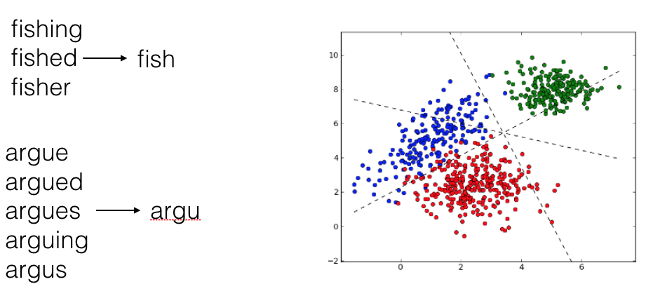
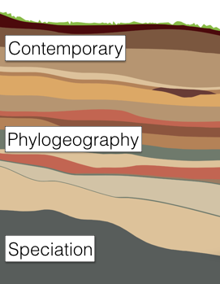
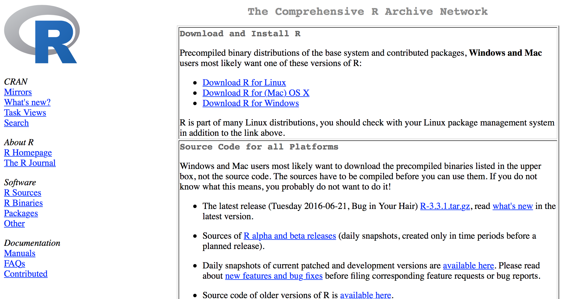
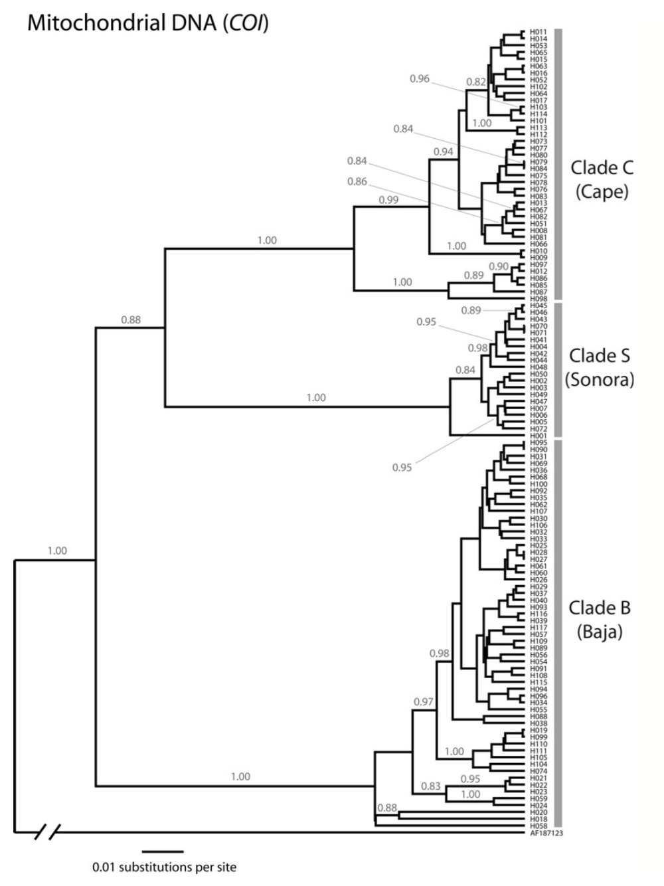

## Overview

- General Overview of the Workshop?
- What is landscape genetics?  
- How do we configure R tools?
- Data sets used.


```{r setup, include=FALSE}
knitr::opts_knit$set(global.par = TRUE)
```

```{r echo=FALSE}
par( bg=NA )
```


<!------------------------------------------------

          Initial Overview of Workshop

------------------------------------------------->

# Workshop Overview


## General Schedule

Over the next five days, we will be covering techniques and approaches that fall into the following general categories.

Day       | Topics
----------|----------------------------------------------------------
Monday    | Overall Introduction & Spatial Data
Tuesday   | Population Genetics & Genetic Data
Wednesday | Defining Functional Relationships
Thursday  | Spatial and Network Approaches
Friday    | Adaptive Genetic Variance


## Resources

We have compiled the following items to help in instruction:

> - Slides for each topic overview and enough background on theory and techniques to 
> - The text, *Landscape Genetic Data Analysis*, is provided as an HTML book.  The source for this text is also available at the [Dyerlab github](https://github.com/dyerlab/Landscape-Genetics-Data-Analysis) site.  This text goes into deeper detail than the slides on each topic.
> - Practical exercises will allow you get your *hands on the data* which will push you to work with data using methods that were covered in both the slides and the text.


## Lectures

Lectures will thematic and are provided as html output.  

> - Focus on background theory as well as the practical approaches used to perform analyses.
> - They are also available at the [Dyerlab github](https://github.com/dyerlab/Landscape-Genetics-Data-Analysis) site in source format in the `presentations` subdirectory.


## Practical Exercises

The overall goal of this workshop is to provide:

- Overview of the background theory used in Landscape Genetic studies.
- A set of reference code and data highlighting how do conduct anlayses that are commonly found in Landscape Genetic studies.
- Practical exercises that allow you to develop your own code to perform these analyses.


<!------------------------------------------------

          What is Landscape Genetics

------------------------------------------------->

# Landscape Genetics

## Landscape Genetics

The term *Landscape Genetics* was coined by Manel *et al.* (2003) as:

> Landscape genetics can resolve population substructure across different geographical scales at fine taxonomic levels; thus, it is different from the existing disciplines of biogeography, which focuses mainly on species diversity patterns at broad temporal and spatial scales, and phylogeography, which combines phylogenetics and biogeography... 

## Landscape Genetics

They further state that it is characterized, in a proceedural way, by:

> The two key steps of landscape genetics are the detection of genetic discontinuities and the correlation of these discontinuities with landscape and environmental features, such as barriers (e.g. mountains, gradient of humidity).

## Landscape Genetics | Literature Review (Dyer 2015) 

<div class="centered">

</div>


## Landscape Genetics


<div class="centered">

</div>


## Landscape Genetics {.columns-2}

```{r, echo=FALSE}
knitr::include_graphics("../media/lg_classification.png",dpi=400)
```


Are *Introduction* and *Methods* of Landscape Genetic manuscripts written in a way that suggests that this new field is a blend (fusion) of both Landscape Ecology and Population Genetics?


## The Canonical Equation

All landscape (and the majority of population) genetic studies can be categorized as trying to quantify the expression:

\[
G \propto f(E)
\]

where $G$ quantifies the spatial distribution of genetic variation, which has been created by some function of external (ecological, environemntal, demographic, spatial) variables $f(E)$.


## Temporal Scales {.columns-2}



Spatial distribution of genetic variance is the results of a stratigraphy of evolutionary and demographic processes.  These historical factors provide constraints on where alleles are and may need to be factored out.

## Populations vs. Individuals 

```{r, echo=FALSE, fig.align="center"}
knitr::include_graphics("../media/LG_Groups.png", dpi=330)
```


## Populations vs. Individuals | Different Causal Factors & Consequences

Analyses focusing on Individual processes differ from those following Population processes.

Factor                     | Individual       | Population
---------------------------|------------------|------------
Generating Processes       | Behavior         | Microevolution
Theory Underpinnings       | Sparse           | Deep
Outcomes                   | Management       | Evolutionary  


<!------------------------------------------------

          Configuring Tool Sets

------------------------------------------------->

# Configuring Tools

## R {.vcenter}

Open, extensible, & powerful data manipulation environment.

```{r echo=FALSE, dpi=144}

```

## RStudio {.vcenter}

```{r echo=FALSE, dpi=180}
knitr::include_graphics("../media/rstudio.png")
```


## Basic Skills 

I am going to assume, for the purposes of this workshop that you already know how do perform the following tasks in R:

1. Start up an R session (preferrably in RStudio)
2. Load data into R
3. Perform basic analyses (`lm`, `aov`, `cor.test`)
4. Install and update libraries.


## Packages Used {.smaller}

```{r echo=FALSE}
files <- list.files(path=c(".","../"),pattern=".Rmd",full.names = TRUE)
libraries <- NA
for( file in files ) {
  suppressWarnings(s <- system( paste("grep -E -o 'library\\(\\w+\\)'",file), intern=TRUE))
  if( length(s) > 0 ) {
    s <- strsplit(s,"(",fixed=TRUE)
    for( item in s ){
      if( length(item) == 2){
        library <- strsplit(item[2],")",fixed=TRUE)[[1]]
        libraries <- c(libraries,library)
      }
    }
  }
}
pkgs <- sort( unique(libraries) )
pkgs <- pkgs[!is.na(pkgs)]
pkgs_df <- data.frame(Title = pkgs, Description = NA)
for(i in seq_along(pkgs)){
  f = system.file(package = pkgs[i], "DESCRIPTION")
  if( nchar(f)> 1) {
    # Title is always on 3rd line
    title = readLines(f)
    title = title[grep("Title: ", title)]
    pkgs_df$Description[i] = gsub("Title: ", "", title)    
  }
}
pkgs_df$Title <- as.character(pkgs_df$Title)
r <- nrow( pkgs_df )
k <- ceiling( r/2 )

m <- matrix( "", nrow=k, ncol=4 )
m[,1] <- pkgs_df$Title[ 1:k ]
m[,2] <- pkgs_df$Description[ 1:k ]

if( (k == r/2)) {
  m[,3] <- paste( "<b>",pkgs_df$Title[ (k+1):r ],"</b>")
  m[,4] <- pkgs_df$Description[ (k+1):r ]
} else {
  m[,3] <- paste("<b>",c(pkgs_df$Title[ (k+1):r ],""),"</b>")
  m[,4] <- c(pkgs_df$Description[ (k+1):r ],"")
}
colnames(m) <- c("Title","Description","Title","Description")
knitr::kable(m)
```


# The Data Sets

## Included Data

You are more than welcome to use your own data at the end of each day and we will do what we can to help you. However, in the course of the practical exercises (and in the text and slides), we will use data that comes with the *gstudio* package.

- Sonoran desert bark beetle *Araptus attenuatus*.  
- Flowering dogwood, *Cornus florida*.

## *Araptus attenuatus*


## *Araptus attenuatus* {.columns-2}

- Sonoran desert endemic
- Post-pleistocene range expansion
- Collections throughout species range
- Nuclear co-dominant & AFLP data

<p></p>

- Large temporal coverage  
- Phylogeography influences inferences
- Iterative landscape genetics


## *Araptus attenuatus* { .columns-2}

```{r echo=FALSE, dpi=144}

```

- `Cryptic` speciation
- Long-time `divergence`
- Reipricol `monophyly`


## *Araptus attenuatus* { .columns-2}

```{r echo=FALSE, dpi=144}
knitr::include_graphics("../media/araptus_structure.png")
```

- `Nested` clustering
- Spatially `restricted`
- Groups in `sympatry`


## *Araptus attenuatus* habitat suitability

```{r echo=FALSE, dpi=144, fig.align="center"}
knitr::include_graphics("../media/araptus_suitability.png")
```

> - Historical habitat and intervening demography leave distinct landscape patterns unrelated to `Landscape Genetic` processes


##  *Cornus florida*

- North American understory tree
- Dioecious
- Common cultivar
- Insect pollinated
- Animal dispersed seeds


## *Cornus florida* 


```{r echo=FALSE, dpi=144, fig.align="center"}
knitr::include_graphics("../media/cornus_florida_connectivity.png")
```


## *Cornus florida* {.columns-2}


```{r echo=FALSE, dpi=144}
knitr::include_graphics("../media/cornus_florida_pollinator_prefs.png")
```

- Non-random connectivity
- Pollinator preference/avoidance


