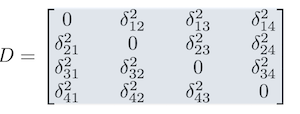

```{r setup, include=FALSE}
knitr::opts_chunk$set(echo = TRUE)
library(ggplot2)
theme_set( theme_bw() )
```

## Synopsis

This afternoon's activity is focused on understanding how to work with genetic marker data in R.  As a base data type, genotypes are neither normal nor multinomial, but follow an algebra befined by Mendelian inheritance and dictated by mating system and ploidy levels.  Here we cover some of the basic material on working with genetic data then dive right into the basis of population genetics---Hardy-Weinberg Equilibrium.  

## Objectives

1. Load data in R using the `gstudio` package.
2. Estimate allele frequencies for entire data sets as well as among subsets of your data (e.g., regions, populations, or locales).
3. Determine if populations or subgroups of individuals deviate from expectations under Hardy-Weinberg Equilibrium.
4. Plot population locales and summary statistics onto maps.
5. Estimate frequencies and diversity along gradients.


                                                                        
    
<!-- ########################################################################
 _____                 _   _       ___  ___           _                 
|  __ \               | | (_)      |  \/  |          | |                
| |  \/ ___ _ __   ___| |_ _  ___  | .  . | __ _ _ __| | _____ _ __ ___ 
| | __ / _ \ '_ \ / _ \ __| |/ __| | |\/| |/ _` | '__| |/ / _ \ '__/ __|
| |_\ \  __/ | | |  __/ |_| | (__  | |  | | (_| | |  |   <  __/ |  \__ \
 \____/\___|_| |_|\___|\__|_|\___| \_|  |_/\__,_|_|  |_|\_\___|_|  |___/
########################################################################  -->                                                                    

## Genetic Markers, Types and Usage

There are several kinds of genetic markers that can be used in landscape genetic analyses, though some are more practical than others.  The limiting factor in deciding on an appropriate marker is the amount of genetic variance in the marker system relative to the features we are testing against.  For example, mtDNA markers are rather common in phylogeography and species and subspecies delimination studies but they evolve at a rate that may be too slow if we are trying to understand contemporary movement patterns.  They will not be able to sptially track variation in a way that a more variable and faster mutating marker type would.

For the purposes of this work, we are going to focus on genetic markers rather than sequence data.  These are most commonly nuclear markers---though there are cpDNA microsat markers in some species that make them very amenable to landscape genetic studies.  

In R, there is not a default data type for genetic markers, and as such we will rely upon one derived in a package created by R. Dyer called *gstudio*.  This package provides not only a default data type `locus` but also the accompanying functions and routines that are commonly used in the spatial analysis of population genetic data (a subset of which we use in Landscape studies).  There are other packages available for genetic analyses, though not all are intercompatible.  In the *gstudio* package, the `locus` object is treated just as any other kind of data and can be inserted contained within `data.frame`, `list`, and `vector` containers just like any other kind of data.  In doing so, it allows the analysis workflow to proceed in a more streamline fashion.

Here are some basic constructs for how to create and manipulate `locus` objects.  A locus is constructed by passing it zero or more alleles.  

```{r}
library(gstudio)
loc0 <- locus()
loc0
```

A locus without alleles is recorded as missing data.^[No need to use negative numbers or any other kind of metric, it is just missing as if you didn't get the observation.]  Alleles within a locus can be defined as charater types, 

```{r}

loc1 <- locus( c("A","B") )
loc1
```

numeric types, 

```{r}
loc2 <- locus( c(128,134) )
loc2
```

or any other construct

```{r}
loc3 <- locus( c("Minor Allele", "Major Allele"))
loc3
```

And collections of them are stored as vectors.

```{r}
loci <- c( loc0, loc1, loc2, loc3 )
loci
```

### Loading External Data

The most way to get genotypes into R is to load them from an external file.  In many labs, genotypic data is kept in a spreadsheet-like format (or `data.frame` in R), where:  

- Each row of the data represent observations on a single individual.  This may include information other than genotypes such as spatial coordinates, sampling locale, internal ID number, etc.   
- Each column represents a single kind of data measured across all observations.  May be missing observations, genotypes, or whatever.  

Loading the data in and configuring the genotypes as `locus` objects requires that we identify the columns of the data that are to be translated into `locus` objects as well as the kind of marker it is representing (AFLP vs. SNP vs. Microsatellite) and the format in which data are currently stored.  The following table provides some of the more commonly used types:

Locus Type  | Description
------------|-------------------------------------------------------------------------------
aflp        | Amplified Fragment Length Polymorphism with bands encoded as $0$ or $1$.
column      | Co-dominant markers such as microsatellite loci encoded as one allele per</br> column of data.  For diploid data, there are twice as many columns of</br> alleles as there are marker loci.
separated   | Co-dominant markers in a single column with alleles separated by a pre-defined </br> symbol (default is ':').  For species with ploidy > 2, this is the default</br> approach for importing polyploid genotypes.
snp         | Alleles encoded by the number of minor alleles 0, 1, or 2.
genepop     | Import from the standard (non-fancy) genepop file format.

Here are some examples data files that are included in the *gstudio* package and how they can be loaded in.  The `path` variable in the following code chunks is the path to the example *.csv file that is located in the *gstudio* package.  For your data, change out the path.  In all cases, the structure that is loaded into R is a `data.frame`.

Here is a raw AFLP file that comes with the *gstudio* package

```{r}
path <- system.file("extdata", "data_aflp.csv", package = "gstudio")
data <- read_population( path, type="aflp", locus.columns = 4:7 )
summary(data)
```

And a two-column microsatellite data file

```{r}
path <- system.file("extdata", "data_2_column.csv", package = "gstudio")
data <- read_population( path, type="column", locus.columns = 4:7 )
summary(data)
```

### Built-In Data Sets

There are some built-in data sets (described in \@ref(data-sets)) that we will be using and can be loaded into your workspaces using `data()`.  The main one in *gstudio* is the *Arapatus attenuatus* data set (referenced in shorthand as `arapat`).  You will become a specialist in desert bark beetle genetics over the course of this workshop.

```{r}
data(arapat)
summary( arapat )
```

This species also has a data set for AFLP markers we will use in the very last day of the workshop.  These were derived from a subset of populations for reasons we will cover over the week.

In working with data in R, the *gstudio* library has added several conviencence functions that help in manipulation and analyses.  Many of the functions in the package make some assumptions about how you have configured your data.  These assumptions are here only because I am a very lazy typist and the less I have to type the better my life is.  By default, I use the convention that the column of data designating your population labels is called <tt>Population</tt>.  I also assume that spatial coordinates are in decimal degrees and are labeled as <tt>Longitude</tt> and <tt>Latitude</tt>.  If you use names other than these, you will have to specify what the 'stratum' variable is and what the coordinate labels are for your `data.frame` of genotypes.  However, if you use those conventions then you do not need to specify anything and any function that needs stratum or coordinates will have it already set as a default.  Here are some easy convienence functions.

Spatial coordinates for strata can be extracted using `strata_coordinates()`, which takes the centroid of all coordinates in each locale.  In the *arapat* data set, all the individuals in the same popualtion have the same spatial coordinate. Here is what those data look like.  Also look at the use of the datatable here, if you present your data in HTML5, you get interactivity!  This can be very helpful in your anlayses and interactions with colleagues, advisors, and students.

```{r}
library(DT)
coords <- strata_coordinates( arapat )
datatable(coords, rownames = FALSE)
```

Creating maps of locales are also such a common feature that *gstudio* has integration with online mapping providers, allowing you to grab some map tiles from Google, OSM, and other map providers and use them to overlay your data.  Just as we did yesterday, the *ggplot* package provides the basic plotting and *gstudio* provided two geometry layers, `geom_strata` and `geom_strata_label` to help out.  Notice here also that for both of these layers, you just pass the raw `data.frame` object to it and as long as you have "Population", "Latitude", and "Longitude" columns in it, the functions take care of the plotting for you.

```{r message=FALSE, warning=FALSE}
library( ggmap )
library( ggplot2 ) 
map <- population_map(coords)
p <- ggmap( map )
p <- p + geom_strata(data=arapat) + geom_strata_label( data=arapat )
p
```


<!-- ########################################################################
  ___  _ _      _       ______                                    _           
 / _ \| | |    | |      |  ___|                                  (_)          
/ /_\ \ | | ___| | ___  | |_ _ __ ___  __ _ _   _  ___ _ __   ___ _  ___  ___ 
|  _  | | |/ _ \ |/ _ \ |  _| '__/ _ \/ _` | | | |/ _ \ '_ \ / __| |/ _ \/ __|
| | | | | |  __/ |  __/ | | | | |  __/ (_| | |_| |  __/ | | | (__| |  __/\__ \
\_| |_/_|_|\___|_|\___| \_| |_|  \___|\__, |\__,_|\___|_| |_|\___|_|\___||___/
                                         | |                                  
                                         |_|                                  
########################################################################  -->


## Allele Frequencies

At a base level, the frequency of alleles constitute the most basic type of data relevant to population genetic analyses.  You can estimate allele frequencies at several different levels from your data.

```{r}
freqs <- frequencies( arapat )
datatable( freqs, rownames = FALSE )
```

By default, function in *gstudio* return the data in a normal `data.frame` object (most cases) or as a `matrix` (in the case of genetic distances).  This ensures that your workflow can proceed in a normal fashion.  However, at times, things like allele frequencies are best handled as matrix objects (e.g., if you are going to use the allele frequencies in multivariate analyses or ordination).  For that purpose in particular, we can use the function `frequency_matrix`

```{r}
freqs_mv <- frequency_matrix( arapat, locus = c("LTRS","ZMP") )
datatable( freqs_mv, rownames=FALSE)
```

creates a wide data.frame format for analyses. Also notice that I included a specification on which loci I wasn interested in using---by default it uses all of them for most analysis functions.  If you don't need all the data, no need to calculate all the parameters and then shuffle through all the output.

Individual stratum-level visualization may help interpret landscape-level patterns of genetic structure.  To estiamte allele frequenies along partitions in your data, you must specify the stratum to use a populations. Here I use the frequency of one of the two alleles at the LTRS locus, estimate by "Population".

```{r}
f <- frequencies(arapat,loci="LTRS",stratum="Population")
f <- f[ f$Allele=="01",]
head(f)
```

whose values can be used diretly in `ggplot` as once we merge in the two `data.frame` objects, combining coordinates and frequencies (to use `merge` you must have a common column in your data.frame that can serve as an index).  The frequency can be displayed as the size of the point

```{r warning=FALSE, message=FALSE}
coords <- merge( coords, f[,c(1,4)])
ggmap( map ) + geom_point( aes(x=Longitude,y=Latitude,size=Frequency),data=coords)
```

or the color of the point

```{r}
ggmap( map ) + geom_point( aes(x=Longitude,y=Latitude,color=Frequency),data=coords)
```

depending upon what you think may be more effective at displaying the spatial patterns.

Another useful display involves taking your frequency data and overlaying it onto google maps as pie charts.  This give you a wide view of all your data.  It does, however, require an internet connection...

```{r eval=FALSE}
pies_on_map( arapat, locus="LTRS")
```

This should pop up a browser window and show you the output.

<iframe width="640" height="480" src="./pies_on_map.html" frameborder="0" allowfullscreen></iframe>

Note the messages about the approximation.  This is because the google maps API has an integer for zoom factor and at times it is not able to get all the points into the field of view using an integer zoom.  If this happens to you, you can manually specify the *zoom* as an optional argument to either function `pies_on_map()` or `population_map()`.  You also need to be careful with the `pies_on_map()` function because the way it works is that the background tile is plotted and then I plot the pies ontop of it.  If you reshape your plot window outside equal x- and y- coordinates (e.g., make it a non-square figure), the spatial location of the pie charts will move!  This is a very frustrating thing but it has to do with the way viewports are overlain onto graphical objects in R and I have absolutely **no** control over it.  So, the best option is to make the plot square, export it as PNG or TIFF or whaterver, then crop as necessary.


<!-- ########################################################################
 _   _               _              _    _      _       _                     
| | | |             | |            | |  | |    (_)     | |                    
| |_| | __ _ _ __ __| |_   _ ______| |  | | ___ _ _ __ | |__   ___ _ __ __ _  
|  _  |/ _` | '__/ _` | | | |______| |/\| |/ _ \ | '_ \| '_ \ / _ \ '__/ _` | 
| | | | (_| | | | (_| | |_| |      \  /\  /  __/ | | | | |_) |  __/ | | (_| | 
\_| |_/\__,_|_|  \__,_|\__, |       \/  \/ \___|_|_| |_|_.__/ \___|_|  \__, | 
                        __/ |                                           __/ | 
                       |___/                                           |___/  
########################################################################  -->

## Hardy-Weinberg Equilibrium

At the heart of population genetics is the expectation that genotypes will occur at predictable frequencies given a set of assumptions about the underlying population.  This is formulated in the enigmatic Hardy-Weinberg Equation, $p^2 + 2pq + q^2 = 1$.  

In this section, we delve in to what that means, where it comes from, and how we can gain biological inferences from data that do not conform to these expectations.  The underlying idea of Hardy-Weinberg Equilibrium (HWE for brevity) is that genotypes should occur at frequencies as predicted by probability theory alone IF (and this is the big part), the population we are looking at is mating in particular ways.  Lets spend a little time talking about what that means and what these assumptions actually are. 

In addition to analyzing your data, you can simulate data in *gstudio* to mimic several of the processes we will discuss in this section.  We will start with the frequencies we calculated in the previous example for the ZMP locus and create a random population with those frequencies.

```{r warning=FALSE}
freqs <- frequencies( arapat, stratum="Species", loci="ZMP")
freqs <- freqs[ freqs$Stratum == "Peninsula",]
locus1 <- make_loci(freqs, N = 100)
data <- data.frame( ID=1:100, Locus=locus1 ) 
summary( data)
```

### Genetic Assumptions
 
Implicit in the description above is a characterization of what constitutes a genotype.  For simplicity, as this is the way it was originally defined, we will assume that the species we are looking at is diploid, carrying homologous chromosomes from both parents.  Diploidy means that in the adult life stage, each individual has two copies of each allele, one from each parental individual. If diploidy is true, we can denote the genotype as $AA$ for the diploid homozygote, $AB$ for the heterozygote, and $BB$ for the other diploid homozygote.  If it is not true and the species (at least at that life stage) is haploid, then will will represent the genotype as $A$ or $B$. Higher levels of ploidy (triploid, tetraploid, hexaploid, etc.) are also possible in many taxa.  While the math that follows is essentially the same for these ploidy levels, the actual algebra is a bit more messy.  If you are working on taxa with higher ploidy levels, you can do many of the same operations we will focus on in gstudio, consult the documentation for more information.  To check the ploidy level in your data (e.g., the number of alleles at a locus) we can use the `ploidy()` function

```{r}
ploidy(data$Locus )
```

In addition to ploidy, genetic constraints on the formulation of the classic HWE assume that the species has two separate sexes, both of which contribute to the next generation.  In general, this rules out uniparentally inherited markers such as mtDNA or cpDNA, which are transmitted in most cases by only one of the sexes during reproduction.  Examining mating events between diploid individuals is something we should all remember from basic biology and genetics through the use of the Punnet Square.  That was a tool designed to teach us about sexual mating, however, it is also a great example of the probabilities of mating we see in sexual reproduction.  These probabilities play direct roles in the derivation of HWE.

Two additional constraints arise directly from diploid sexual reproduction.  First, we assume that the likelihood of a particular allele is independent of the sex of the individual that contains it.  For example, male individuals should have as many alleles (e.g., no sex chromosomes that mix ploidy of genotypes) and alleles at that can occur with equal frequency as the other sex (no sex biased alleles probabilities as may arise from say sex-biased lethals).  

Finally, we will invoke both of Mendel's Laws of Inheritance.  His first law states that the alleles at a particular locus are statistically independent from each other.  If there is an A allele provided by one parent, the probability of the second allele is either $A$ or $B$ is entirely independent of that first alleles state.  The second law, though not necessarily relevant for many HWE applications, deals with the probability of genotypes at two loci.  Here we assume that the alleles present at one locus are statistically independent of those at the other locus.  We will return to this when we get to linkage but for now lets assume it is a valid assumption.

### Punnet Squares

A Punnet square is a simple tool used to teach transition probabilities in basic genetics and biology courses.  Here is an interactive example using the 2-allele locus (though the tool can handle other ploidy levels) that you can play with to see the kinds of offspring genotypes produced by individual matings.  

The population we are examining need to have some specific demographic parameters for HWE to be valid.  The most basal assumption that is invoked is that the population size must be very large.  In a fact, most of the work of R.A. Fisher and J.B.S. Haldane in developing the modern synthesis relied upon this assumption as well.  If population size, $N$, is too small, then the stochastic change (what we call genetic drift) can have serious influences on allele frequencies.  

As a simulation tool, it is very important to undertand that when doing stocahastic approximations, $N$ has a huge effect.  Consider the following:

```{r}
genotype_frequencies( data$Locus )
```

Here the expected counts are $Np^2$, $N2pq$, and $Nq^2$, conforming to the expectations from HWE, though they do differ a smidge (vernacular for small amount) from the true expectations.  When you do simulation work, you need to accept this variability as a component of the system.  However, reality also conforms to these same issues, populations are not infinite, populations are finite in size, etc. Perhaps the issue is our portrayal of the natural world using conventions like $N=\infty$, the genetic neighbrohood is defined by a perfect circle with a constant radius, and dispersal follows a continuous and isotropic distance function...  These are great to make the equations better for theoreticians but may not capture the kinds of dynamic processes that are most important to landscape genetic studies.

Next, and perhaps this is more for our laziness than any other reason, we assume that the generations do not overlap.  This means that the during a single generation, all individuals participate in the mating events, each of which is equally likely to be selected as one participating in a mating event (e.g., random mating).  For simplicity, lets denote the frequencies of these genotypes as $f(AA) = P$, $f(AB) = Q$, and $f(BB) = R$. If these individuals are really mating randomly with respect to their genotypes, then the probability of union between any pair is simply the product of their population frequencies.  

&nbsp; | **AA** | **AB** | **BB**
:-----:|:------:|:------:|:-------:
**AA** | $P^2$  | $PQ$   | $PR$
**AB** | $PQ$   | $Q^2$  | $QR$
**BB** | $PR$   | $QR$   | $R^2$


More importantly for our simplicity in terminology, at the end of the mating episode, all of the next generations offspring are produced and all adults die.  If there were overlapping generations or multiple mating events, we would have to integrate these processes along a continuous timescale rather than treating a single mating generation as a discrete unit.  Totally possible, and even fun, but not part of the original formulation of HWE.  

Notice how the frequencies changed across mating events (that is exactly what we call *genetic drift*).  The smaller the population size, the larger the deviation across generations.  

### Evolutionary Assumptions

Finally, we need to invoke evolutionary assumptions to meet the requirements of HWE.  First, we must assume that there is $AB$solutely no mutation.  A non-zero mutation rate, $\mu > 0$, means that the state of a particular allele, say the $A$ allele, has a likelihood of spontaneously becoming something other than the $A$ allele (e.g., the $B$ in this formulation).  If HWE is to help us determine the genotype frequencies having one allele spontaneously mutate to another would require that we integrate the mutation rate into HWE directly.  Perhaps not that surprisingly, that wasn't integrated back in the day.

The next assumption has a very similar consequence.  Namely, we must assume that the set of individuals that are participating in the mating event in this population is static. Individuals from other populations are not immigrating into this population and individuals within the population are not emigrating out of this population.  Just like mutation, and when we get to migration we will see directly how similar these processes are, we will take the easy way out and assume that they do not occur.  

The final assumption is based upon selection and is a very easy one to deal with.  We simply assume it doesn't happen.  If selection were operating, say an extreme form such as increased lethality of the $AA$ genotype prior to reproduction, then we would have to both specify the way in which selection is operating as well as the its magnitude.  We will come back to this topic later but for the simplicity of HWE, we make the assumption that it has no effect.

### The Mechanics

In a sampled population, we estimate the frequencies of the genotypes as:

$P = \frac{N_{AA}}{N}$,

$Q = \frac{N_{AB}}{N}$, 

and

$R = \frac{N_{BB}}{N}$

where $N_{XX}$ is the number of $XX$ genotypes and $N$ is the total number of individuals in the sample.  Using either $table()$ or $genotype_frequencies$ provides the same information.  From these genotype frequencies, we can directly estimate the frequency of each allele ($A$ and $B$) denoted as p and q as:

$f(A) = P + \frac{Q}{2} = p$

and 

$f(B) = R + \frac{Q}{2} = q$

using the lower case versions of $p$ and $q$.  This is exactly what the `frequencies` function actually does.  Be careful about mixing up the upper and lower case variables. The population geneticist [John Nason](http://jnason.eeob.iastate.edu), makes the connection that this is what it means to “mind our p's and q's" though I suspect the etiology of this statement has more to do with liquid volume measurements than population genetics...  

Intuitively the formulation denoted above for $p$ and $q$ makes sense as the heterozygote genotype ($AB$) frequency, $Q$, is split evenly between the homozygote genotype frequencies, $P$ (for $AA$) and $R$ (for $BB$). This can be programatically shown as via the `transition_probability()` function (takes offspring, mom and dad gentoypes):

```{r}
AA <- locus( c("A","A") )
Aa <- locus( c("A","a") )
aa <- locus( c("a", "a") )
transition_probability( AA, Aa, Aa )
transition_probability( Aa, Aa, Aa )
transition_probability( aa, Aa, Aa )
```

If these are the only two alleles in the population then there is the additional restriction that $p + q = 1$.  It is easy to expand these methods to more than two alleles, but again the original approximation was specifically set for 2-allele systems.

### Trans-Generational Transition Probabilities

If the above expectations hold, then it is possible to iterate through all possible combinations of matings, noting the probability of observing each type, and estimate the frequency of offspring genotypes.  This is a bit messy and is probably better displayed in tabular format.

Parents   | $\mathbf{P(Parents)}$ | $\mathbf{P(AA)}$ | $\mathbf{P(AB)}$ | $\mathbf{P(BB)}$
------------|:----------:|:-------:|:-------:|:-------:
$AA\;x\;AA$	| $P^2$      | $P^2$	 | &nbsp;  | &nbsp;
$AA\;x\;AB$	| $PQ$       | $PQ/2$  | $PQ/2$  | &nbsp;	
$AA\;x\;BB$	| $PR$       | &nbsp;  | $PR$	   | &nbsp;
$AB\;x\;AB$	| $Q^2$      | $Q^2/4$ | $Q^2/2$ | $Q^2/4$
$AB\;x\;BB$	| $QR$       | &nbsp;  | $QR/2$	 | $QR/2$
$BB\;x\;BB$	| $R^2$      | &nbsp;  | &nbsp;  | $R^2$

During the parents generation, the frequencies of $AA$, $AB$, and $BB$ were $P$, $Q$, and $R$, defining allele frequencies as $p$ and $q$.  If we invoke all those assumptions about genetic, demographic, and evolutionary processes being absent from mating and production of offspring genotypes (e.g., notice how we do not have any terms in there for mutation, being sex biased, etc.) then the frequency of genotypes at the next generation are defined in the table.  For example, at the next generation, say $t+1$, the frequency of the $AA$ offspring in the population is the sum of probabilities of all matins that produced $AA$ genotypes.

$$
\begin{aligned}
P_{t+1} &= P_{t}^2 + \frac{P_tQ_t}{2} + \frac{Q^2_t}{4} \\\\ 
&= \left( P_t + \frac{Q_t}{2} \right)^2 \\\\
&= p^2
\end{aligned}
$$

The other homozygote is the same producing an expectation of the frequency of the $BB$ genotype at $t+1$ of $q^2$.  Similarly for the heterozygote

$$
\begin{aligned}
Q_{t+1} &= \frac{P_tQ_t}{2} + 2P_tR_t + \frac{Q^2_t}{2} + Q_tR_t\\
&= 2\left(P_t + \frac{Q_t}{2} \right)\left(R_t + \frac{Q_t}{2}\right)\\
&= 2pq
\end{aligned}
$$

Putting these together, we have an expectation that the genotypes $AA$, $AB$, and $BB$ will occur at frequencies of $p^2$, $2pq$, and $q^2$, which is exactly what HWE is.  More importantly, it takes only one generation of mating under the assumptions of HWE to return all genotype frequencies to HWE!  However, the real population frequences differ a bit due in part (mostly) the finite size of populations.  Here we can simulate a generation of mating in the previous data as:

```{r}
next_gen <- mate( data, N=1 )
table( data$Locus ) / nrow( data )
table( next_gen$Locus ) / nrow( data )
```


### Consequences of HWE

The consequences of this are important for our understanding of what processes influence population genetic structure.  If none of these forces are operating in the population, then the expectation is that the allele frequencies should predict genotype frequencies.  However, if there are some forces that are at work, genetic, demographic, or evolutionary, then the frequencies at which we see these genotypes will deviate from those expectations.  Now, biologically speaking, is there any population that conforms exactly to these expectations—--definitely not!  However, in many cases populations are large enough to not be influenced by small N, mutation is rare enough to not cause problems, etc.  

Using HWE, we can gain some insights into the which sets of forces may be influencing the observed  genotype frequencies.  In large part, we examine these changes as deviations from expectations with respect to loss or gain of heterozygotes.  These expectations, as depicted above, define an idealized situation against which we measure our data.  This metric was specifically designed to ignore almost every process and feature that population geneticists would be interested in looking at.  If our data are consistent with these expectations then we have no support for the operation of any of these processes.  Boring result, no?  In a larger sense, the entire field of Population Genetics is devoted to understanding how violations of these assumptions influence population genetic structure.  If everything was in HWE and none of these processes were operating, there would be very little for us to do besides DNA fingerprinting and we would all be forensic examiners...

If some of these features are operating, they do have specific expectations on how they would influence the frequency of genotypes (specifically the homozygotes).  Specific examples include:  

Decrease Heterozygosity | Increase Heterozygosity
------------------------|---------------------------
Inbreeding | Coding Errors
Null Alleles | Gametic Gene Flow
Positive Assortative Mating | Negative Assortative Mating
Selection against Heterozygotes | Outbreeding
Wahlund Effects | Selection for Heterozygotes

In closing, it should be noted that HWE presented here is easily expandable to loci with more than two alleles as well as for loci with different ploidy levels.  The same approaches apply, though it is not as clean to estimate the expectations.  In the next section, we look at how we specifically test for HWE in our data.

At a more meta level, one could see the entirety of this topic and population genetics as a discipline as understanding how deviations from HWE manifest and testing for the strength of these deviations.  It is becoming less common for people to actually test for HWE as there are many ways that you can have a deficiency (or excess) of heterozygotes and it is probably much better to focus on the specific processes that may causing these deviations rather than the magnitude of the deviation alone.  That said, it is a nice organizing principle to use HWE as a straw man argument on which to frame the rest of this topic.


## Genetic Diversity

At a base level, genetic diversity is the fundamental components upon which evolution operates. Without diversity, there is no evolution and as such species cannot respond to selective pressure. Genetic diversity is a property of sampling locales.  It is created and maintained by demographic and evolutionary processes and the history of the organisms being examined.  It is also used as a surrogate measure for the consequences of several microevolutionary processes. In this section, we will examine how to estimate genetic diversity within a sample of individuals.

Genetic diversity is estimated in R using the function `genetic_diversity()` contained within the gstudio library.  Here is the documentation for this function.  We will walk through the various parameters and illustrate their use with this dataset.

<div style="height:250px;white-space:pre-wrap;overflow:scroll;padding:8px;background:#eee;outline: 1px #eee;font-size:small"><pre>
genetic_diversity {gstudio} 						R Documentation

Estimate genetic diversity

Description

This function is the main one used for estimating genetic diversity among strata. Given the large number of genetic diversity metrics, not all potential types are included.

Usage
genetic_diversity(x, stratum = NULL, mode = c("A", "Ae", "A95", "He", "Ho",
  "Fis", "Pe")[2])

Arguments

x - A data.frame object with locus columns.
stratum - The strata by which the genetic distances are estimated. This can be an optional parameter when estimating distance measures calculated among individuals (default='Population').
mode - The particular genetic diversity metric that you are going to use. The gstudio package currently includes the following individual distance measures:
	A   	Number of alleles
	Ae	Effective number of alleles (default)
	A95	Number of alleles with frequency at least five percent
	He	Expected heterozygosity
	Ho	Observed heterozygosity
	Fis	Wright's Inbreeding coefficient (size corrected).
	Pe	Locus polymorphic index.

Value

A data.frame with columns for strata, diversity (mode), and potentially P(mode=0).

Author(s)

Rodney J. Dyer rjdyer@vcu.edu

Examples

AA <- locus( c("A","A") )
AB <- locus( c("A","B") )
BB <- locus( c("B","B") )
locus <- c(AA,AA,AA,AA,BB,BB,BB,AB,AB,AA)
locus2 <- c(AB,BB,AA,BB,BB,AB,AB,AA,AA,BB)
Population <- c(rep("Pop-A",5),rep("Pop-B",5))
df <- data.frame( Population, TPI=locus, PGM=locus2 )
genetic_diversity( df, mode="Ae")
</pre></div>


### Allelic Diversity

At the base level, a collection of alleles in a dataset provides an estimate of the breadth of genetic variation present. There are many measures commonly used in population genetics, though $A$, $A_{95}$, and $A_e$ are quite commonly encountered.  These terms are defined as:

*Frequency Independent Diversity* - The parameter $A$ measures the raw count of the number of alleles present in the sample.  This is a frequency independent estimate of diversity as it does not matter if the allele is only seen once or is seen hundreds of times in the sample.  

Technically, we define this parameter as  

\[
A = \ell
\]

where $\ell$ is the number of observed alleles.  We can estimate allelic diversity by passing the function either a vector of locus objects

```{r}
genetic_diversity( arapat$MP20, mode="A" )
```

or a `data.frame` that has one or more columns of data that are locus objects as determined by the `column_class()` function.  

```{r}
genetic_diversity( arapat, mode="A" )
```

The concern associated with using a parameter such as $A$ is that it throws away any information about relative abundance.  For example, a dataset with alleles found at an abundance of $N_A = 999$ and $N_B = 1$ would have the exact same frequency independent diversity as another sample with $N_A = N_B = 500$, namely $A = 2$.  

*Frequency Dependent Diversity* - A slightly more stringent approach may be to estimate the diversity of alleles in a frequency dependent fashion, specifying a particular cutoff.  The parameter $A_{95}$ is a common parameter that provides a count of the number of alleles present in a sample whose frequencies exceed a threshold of 5%.  

\[
A_{95} = \left| A_{freq(\ell)>0.05} \right|
\]

This threshold is entirely arbitrary in the same way that we use $\alpha=0.05$ as a cutoff in the teaching of formalized hypothesis testing.  It could just as easily be 3%, 1%, or 10% but has a historical trajectory  in its current form.  The $A_{95}$ parameter does remove some of the problems associated with rare alleles in our data sets as is shown by comparing the diversity of the most allele rich locus MP20 using $A$

```{r}
mp20.A <- genetic_diversity( arapat$MP20, mode="A")
mp20.A
```

and $A_{95}$

```{r}
mp20.A95 <- genetic_diversity( arapat$MP20, mode="A95")
mp20.A95
```

Here 15 of the alleles we observed in the full dataset occurred at a frequency less than 5%!

*Effective Number of Alleles* - Given the arbitrary nature of the cutoff for $A_{95}$, a more parsimonious approach may by one that measures the contribution of each allele to diversity in proportion to its frequency.  This is $A_e$ and it is defined as:

\[
A_e = \frac{1}{\sum_{i=1}^\ell p_i^2}
\]

and is the default mode of diversity provided by the `genetic_diversity()` function (e.g., the one you get if you do not specify `mode=`).

```{r}
genetic_diversity( arapat, mode="Ae")
```

Notice that $A \ge A_e \ge A_{95}$, as $A_e$ integrates the contributions of those low frequency alleles.  None of these parameters are perfect, though all provide some measurement of diversity at the level of the allele.

### Genotypic Diversity

In addition to diversity at the level of alleles, we also can estimate diversity at the level of the genotype.  There are several parameters that can be derived for genotypic diversity but the most common are observed and expected heterozygosity.  Observed heterozygosity is simply the fraction of all genotypes in the sample that are not homozygotes.

\[
H_O = \frac{N_{ij}}{N}
\]

where $N_{ij}$ is the count of all heterozygous genotypes.  The `mode="Ho"` option in `genetic_diversity()` returns these values. 

```{r}
genetic_diversity(arapat, mode="Ho")
```

The second parameter, expected heterozygosity ($H_e$), is slightly different in that it is a parameter that needs to be estimated from data.  It represents the fraction of genotypes in the dataset that are expected to be heterozygous, if the sample is in equilibrium.  The value for this function depends upon the data that you are estimating and how it is configured.  If it is estimated from a single locale, then the parameter can be estimated directly as the expected fraction that are not homozygous.

\[
H_E = 1 - \sum_{i=1}^\ell p_i^2
\]

(where $\ell$ is the number of alleles at the locus).  Here is an example of expected heterozygosity for the LTRS and MP20 loci.

```{r}
genetic_diversity( arapat$LTRS , mode="he")
genetic_diversity( arapat$MP20, mode="he" ) 
```

In an ideal world, we would be able to have enough resources to sample for these parameters with so many individuals, they would be well behaved.  Unfortunately, we do not live in the real world and in many cases our ability to sample lots of individuals is limited.  This problem is not a new thing, we estimate the sums of square and divide by $N-1$ instead of $N$ because if we we use the later, we are producing a biased estimate.  Unless you are working with *all* the samples, every time we make population genetic inferences we will be doing so on a subsample of the total data available.  The `arapat` data set is no where near a major component of the species, it is only a sample.  From this sample, we *estimate* allele frequencies on which we derive our *estimates* of parameters such as $H_E$.  As such, if we used the formulas above to estimate everything in every study, we would have biased estimators of... pretty much everything.  However, the fix is not one that is too difficult to put in, and it has a pretty well established set of behaviors.  As such, if we are estimating these parameters in a single locale (for more than one location, we have further corrections to make), we should probably apply a small sample size correction.  In general, this correction is:

\[
\hat{H}_e = \frac{2N}{2N-1}\left[ 1-\sum_{i=1}^\ell p_i^2 \right]
\]

The front part is a small sample size correction factor.  Its importance in your estimation diminishes as $N \to \infty$ as shown in Figure \@ref(fig:biasCorrection).  Once you get above $N=9$ individuals, there is an inflation of the estimated heterozygosity at a magnitude of less than 5%. 

```{r biasCorrection, echo=FALSE, fig.cap="Magnitude of the correction factor for small sample size estimations as a function of N.", message=FALSE}
library(ggplot2)
N <- 1:100
CF <- (2*N) / ( 2*N-1)
df <- data.frame( N, CF)
ggplot( df, aes(N,CF) ) + geom_line()
```


### Samples from Several Locales 

In addition to problems associated with estimating allele freqeuncies incorrectly (and requiring a sample size correction), when we estimate data from several locations, we also have a problem assocaited with the subset of locales relative to the total popualtion size, resulting in a furhter correction to account of the several biased samples you are taking.

\[
H_S = \frac{\tilde{N}}{\tilde{N}-1}\left[ 1 - \sum_{i=1}^\ell \frac{p_i^2}{K} - \frac{H_O}{2\tilde{N}} \right]
\]

where $\tilde{N}$ is the harmonic mean number of genotypes sampled across each of the $K$ strata.  Notice here I use the term $H_S$ instead of $H_E$ so that there isn't any doubt about the differences when we write and talk about these parameters.  This formulation (after Nei 1987) corrects for the sampling across separate  locations.  To indicate that your estimate is being made using subdivided groups of samples, pass the `stratum=` parameter to `genetic_diversity()` and set `mode="Hes".  We can see the magnitude of the correction by looking at a single population and comparing the estimates of $H_S$ for corrected and non-corrected parameters.

```{r}
pops <- arapat[ arapat$Population %in% c("32","101","102"),]
he <- genetic_diversity( pops, mode="He")
hes <- genetic_diversity(pops, stratum="Population", mode="Hes")[1:8,]
df <- data.frame(Locus=he[,1], He=he[,2], Hes=hes[,2])
df
```

```{r echo=FALSE}
df <- df[ !is.na(df$Hes),]
p <- format(round(cor(df$He,df$Hes),2),nsmall=3)
```


They are pretty close (Pearson's $\rho =$ `r p`), even when there are only `r nrow(pops)` individuals in the sample.^[The `NA` in the $H_{ES}$ parameter is because there are no smaples in one of the populations and a harmonic mean with a zero in it results in a divide-by-zero error.]  But they are off and this is a vitally important distinction because if you do not account for these differences you will percolate these errors up through your subsequent analyses (and this is a bad thing).

### Multilocus Diversity

There are several measures of individual locus diversity but few for multilocus diversity.  One potential measure for diversity across loci is to based upon the fraction of population that has unique multilocus genotypes.  This is defined as:

\[
D_m = \frac{N_{unique}}{N}
\]

and can be estimated using the function `mulitlocus_diversity()`.  Looking across the putative species indicated in the data set, we can see that in general, the Cape populations are much less diverse than those individuals samples throughout Baja California.

```{r}
multilocus_diversity( arapat[ arapat$Species=="Cape",])
multilocus_diversity( arapat[ arapat$Species=="Mainland",] )
multilocus_diversity( arapat[ arapat$Species=="Peninsula",] )
```

This is a pretty crude measurement but later when we examine models based upon conditional multilocus genetic distances, we need to make sure that the samples are both allelic rich and multilocus diverse and this approach is a nice way to do that.


### Inbreeding 

Inbreeding is one of the most common deviations from random mating (and hence Hardy-Weinberg Equilibrium) that we encounter in natural populations.  Inbreeding is defined, sensu stricto, as mating between two related individuals.  This ranges from complete selfing, where one parent alone produces offspring, to consanguineous mating, where individuals with some degree of relatedness produce offspring.  The genetic consequences of inbreeding are entirely in how alleles are arranged into genotypes, not in changing allele frequencies.

The primary consequence of inbreeding is a reduction in the frequency of the heterozygous genotype.  Consider the following Punnet square where a heterozygote is producing a selfed offspring.

&nbsp; | $A$  | $B$
-----:|:----:|:----:
$A$   | $AA$ | $AB$
$B$   | $AB$ | $BB$

The offspring in the next generation are only 50% heterozygotes.  Each generation of selfing,  homozygotes produce homozygotes but only half of the offspring from heterozygotes stay as such. This process increases the relative frequency of homozygous genotypes in the population, though if you look at the offspring, the frequency of alleles do not change—there are as many A alleles as B alleles in the next generation of selfing. 

Conceptually, we can define an inbreeding parameter, $F$, depicting the extent to which genotype frequencies have deviated from HWE due to inbreeding. But to do so, we need to differentiate between homozygote genotypes that have the same alleles because they are inbred (e.g., both alleles can be traced to a single allele in common ancestor) from those that are identical because they just happen to have the same allele (not of common ancestry). For this, we will define terms for these genotypes as:

**Autozygous** - Two alleles that are identical within a genotype because they came from the same individual in the previous generation. These alleles are Identical by Descent and will be found in the population at a rate of $pF$.

**Allozygous** - Two alleles that are identical within a genotype but they came from alternate individuals in the parental generation. These alleles have Identity by State and are expected to occur at a frequency of $p^2(1-F)$.

Together, the expected frequency of the AA genotype, $E[AA] = p^2(1-F) + pF$.

At the extremes, if there is no inbreeding—all homozygotes are allozygous—the inbreeding statistic, $F=0$ and the expectation reduces to $E[AA] = p^2$.  Conversely, if all offspring are the result of selfing, $F=1$ and $E[AA] = p$. 

Often the parameter $F$ is the subject of our analyses and the item that is to be estimated from genetic data.  Give the definition above, $F$ is defined as the proportional loss of heterozygosity and is estimated as:

\[
\begin{aligned}
F &= \frac{H_e - H_o}{H_e} \\ 
  &= 1 - \frac{H_o}{H_e}
\end{aligned}
\]

Programatically, we can estiamte the inbreeding statistic, $F$, using `genetic_diversity()`.  Technically, this statistic is referred to as $F_{IS}$, the subscripts indicating that the level of inbreeding is in the **I**ndividual relative to the expectations of the *S*ubpopulation.  There are other levels of inbreeding we will estimate below, which is why we need to make this distinction.

```{r}
genetic_diversity( data, mode="Fis")
genetic_diversity( arapat, mode="Fis")
```


## Rarefaction 

The primary reason for looking at diversity is to perform some comparison, which provides some insights into the biological and/or demographic processes influencing your data.  Without a basis for comparison, diversity estimates are just numbers. However, deriving an estimate of diversity is a statistical sampling process and as such we must be aware of the consequences our sampling regime has on the interpretation of the data.  This is where rarefaction comes in, a technique commonly used in ecology when comparing species richness among groups.

Here is an example of the problem sampling may interject into your analyses.   Consider a single locus with four alleles.

```{r message=FALSE, warning=FALSE}
library(gstudio)
data(arapat)
f <- data.frame( Allele=LETTERS[1:4], Frequency=0.25)
f
```

Selected as a random sample from an infinite population. The first sample has 5 individuals.

```{r}
pop1 <- make_population( f,N=5)
ae1 <- genetic_diversity( pop1, mode="Ae" )
ae1
```

And the second one has 100 individuals.

```{r}
pop2 <- make_population( f, N=100 )
ae2 <- genetic_diversity( pop2 )
ae2
```

The difference in estimated diversity among these groups are `abs( ae1 - ae2 ) = 0.15`.  Is this statistically different or are they the same?  Is it just because we sampled more individuals in the second set that we get higher values of $A_e$? Consider the `MP20` locus in the beetle data set, it has a total of 19 alleles present.  If we subsample this data and estimate the number of observed alleles, we see that there is an asymptotic relationship between sampling effort and estimates of allelic diversity.  Here is the code for estimating frequency independent diversity, $A$, using these data.

```{r}
loci <- arapat$MP20
sz <- c(2,5,10,15,20,50,100)
sample_sizes <- rep( sz, each=20 )
Ae <- rep(NA,length(sample_sizes))
for( i in 1:length(Ae)){
  loci <- sample( loci, size=length(loci), replace=FALSE)
  Ae[i] <- genetic_diversity( loci[1:sample_sizes[i]], mode="Ae" )$Ae
}
```

```{r echo=FALSE}
df <- data.frame( Sample_Size=factor(sample_sizes), Ae )
ggplot( df, aes(x=Sample_Size, y=Ae)) + geom_boxplot() + theme_bw() + xlab("Population Sample Size (N)") + ylab("Effective Allelic Diversity (Ae)")
```

The ‘curvy' nature of this relationship shows a few things.  

It takes a moderate sample size to capture the main set of alleles in the data set.  If we are looking at allocating sampling using only 5 individuals per locale, then we are not going to get the majority of the alleles present.

For the rare alleles, you really need to grab large at-site samples if estimates of diversity are the main component of what you are doing.  Do rare alleles aid in uncovering the biological processes you are interested in studying?  They may or may not.

For most purposes, we will use all the samples we have collected.  In many cases though, some locales may not have as many samples as other ones.  So, even with these data, if I have one locale with 10 samples and another with 50, how can I determine if the differences observed are due to true differences in the underlying diversity and which are from my sampling?  Just as in testing for HWE, we can use our new friend permutation to address the differences.

Rarefaction is the process of subsampling a larger dataset in smaller chunks such that we can estimate diversity among groups using the same number of individuals.  Here is an example in the beetle dataset where I am going to look at differences in diversity among samples ($N = 75$) collected in the cape regions of Baja California 

```{r}
ae.cape <- genetic_diversity( arapat[ arapat$Species=="Cape", "WNT"] )
ae.cape
```

and compare those to the genetic diversity observed from a smaller collection of individuals sampled from mainland Mexico ($N=36$).

```{r}
ae.mainland <- genetic_diversity( arapat[ arapat$Species=="Mainland", "WNT"] )$Ae
ae.mainland
```

The observed difference in effective allelic diversity, $A_{e,mainland} == A_{e,cape}$, could be because the Cape region of Baja California is more diverse or it could be because there are twice as many individuals in that sample.   

To perform a rarefaction on these data, we do the following:  

1. Use the size of the smallest population ($N$) as the sample size for all estimates.
Randomly sample individuals, without replacement, from the larger dataset in allocations of size $N$.  
2. Estimate diversity parameters on these subsamples and repeat to create a 'null distribution' of estimated diversity values.  
3. Compare your observed value in the smallest population to that distribution created by subsampling the larger population.  

From the data set, this is done by

```{r}
cape.pop <- arapat[ arapat$Species=="Cape","WNT"]
null.ae <- rarefaction( cape.pop, mode="Ae",size=36)
mean(null.ae)
```

So even if the samples sizes are the same, the mean level of diversity remains relatively constant.  The range in diversity

```{r}
range(null.ae)
```

is quite large.  Since this estimate is frequency based, random samples of alleles change the underlying estimate of Ae during each permutation.  

The observed estimate of diversity in the Mainland populations does fall within this range.  However, the null hypothesis states that $A_{e,mainland} = A_{e,cape}$ and if this is true, once we standardize sample size, we can take the distribution of permuted Ae values as a statement about what we should see if the null hypothesis were true.  As such, we can treat it probabilistically and estimate the probability that $A_e$, Mainland is drawn from this distribution.

```{r}
all.ae <- c( null.ae, ae.mainland)
P <- sum(ae.mainland <= null.ae) / ( length(all.ae) )
P
```

Or graphically, it can be depicted as below.

```{r echo=FALSE}
df <- data.frame( Observation = c(rep("Permuted",length(null.ae)),"Observed"),
                  Value = all.ae )
ggplot( df, aes(x=Value, fill=Observation)) + geom_histogram(bins=30) + theme_bw() + xlab("Allelic Diversity") + ylab("Frequency")
```


### Mapping Diversity

Estimating diversity is great and being able to compare two or more groups for their levels of diversity is even better.  But often we are looking for spatial patterns in our data.  Both R and gstudio provide easy interfaces for plotting data and later in the text we will see how to integrate raster and vector data into our workflows for more sublime approaches to characterizing population genetic processes.  In the mean time, it is amazingly easy to use basic plotting commands to get pretty informative output.  In this example, I extract the mean coordinate of each stratum in the arapat dataset and then estimate diversity at the level of these partitions and merge the diversity estimates for the AML locus into the coordinate data.frame.  

```{r}
library(gstudio)
data(arapat)
diversity <- genetic_diversity(arapat, stratum="Population", mode="Ae")
coords <- strata_coordinates(arapat)
coords <- merge( coords, diversity[ diversity$Locus == "AML", ] )
```

Then, I grab a map from the Google server and map my populations with diversity depicted as differences in the size of the points.  Note that the `ggmap()` function provides the base map that is retrieved but when we use `geom_point()` we need to specify the `aes()` and the `data=` part as these data are from the `data.frame` we made, not from the map we grabbed from Google.

```{r warning=FALSE}
library(ggmap)
map <- population_map(coords)
ggmap(map) + geom_point( aes(x=Longitude,y=Latitude,size=Ae), data=coords)
```


## Genetic Distance

One can measure the relative distance between items based upon some basic assumptions.  In Euclidean geometry, the underlying distance measures are based upon the triangle inequality.  The same kinds of approaches are available in characterizing genetic separation, either among individuals or among locales.  This chapter introduces some of the methodologies used in estimating genetic distances, how we analyze them, and how we portray our results in a graphical fashion amenable for interpretation.

Underlying most estimates of genetic distance are sets of geometric and/or evolutionary assumptions.  There are many different metrics that could be estimated from our genetic data, many of which will tell us the same general story.  However, there are specific features of our data that may make one kind of metric more appropriate than another type.

There are two main characteristics that control our ability to map collections of genotypes onto a real number line; Self identity and Symmetry.  Self identity implies that the distance, $\delta$, between an object (a single genotype or a collection of genotypes in a population) and itself must be zero: $\delta_{ii}=0$.  You are absolutely identical to yourself.  Symmetry implies that the distance between objects is independent of the order in which we measure it; $\delta_{ij} = \delta_{ji}$.  This can be a more problematic assumption in some cases and when we examine estimation of ecological distances later, we will see this may not be the case.  

If these two conditions are satisfied, the distance may be considered *metric* if (and only if) it satisfies the triangle inequality, $\delta_{ij} \le \delta_{ik} + \delta_{kj}$.  We've seen this relationship in Euclidean Geometry, the squared length of the hypotenuse is equal to the sum of the squared length of both legs in a triangle; $z^2 = x^2 + y^2$.

Genetic distance itself is not the final product that allows us to gain inferences about underlying population genetic processes.  Rather, it is the input into subsequent analyses.  This section focuses first on how we estimate distances, depending upon the level of interest, and then highlights some approaches for visualizing and gaining inferences from the distance matrix itself.  In later chapters, we return to the use of distance matrices when we examine network models and analyses based upon the idea of isolation models commonly used in modern population genetic analyses.

### Individual Genetic Distance

Genetic distance can be estimated based upon differences at many levels, the most basal of which is among individuals.  In the discussion of the individual genetic distances, the following genotypes will be used for illustrative purposes.

```{r message=FALSE}
library(gstudio)
AA <- locus(c("A", "A"))
AB <- locus(c("A", "B"))
BB <- locus(c("B", "B"))
BC <- locus(c("B", "C"))
AC <- locus(c("A", "C"))
CC <- locus(c("C", "C"))
Locus <- c(AA, AB, AC, BB, BC, CC)
Locus
```

#### Euclidean Distance

The most basic distance metric we can use would be Euclidean.  Intuitively, we have a good idea about how this metric works as we use it every day.  Euclidean distance is estimated as:

\[
\delta_{eucl} = \sqrt{\sum_{i=1}^\ell (p_{xi}-p_{yi})^2}
\]

where $p_{x•}$ is a vector of allele frequencies measured on the $x^{th}$ individual. We can create these by translating the raw genotypes into multivariate data as we in the previous section on individual and population assignment.

```{r}
mv.genos <- to_mv(Locus)
mv.genos
```

and then using the `dist()` function that R has built-in to estimate $\delta_{eucl}$

```{r}
D.euc <- dist( mv.genos )
D.euc
```

The output variable, `D.euc`, is of type

```{r}
class(D.euc)
```

which is definitely not a matrix object. It is a specific data type that is used for dealing with distance matrices.  There are some analyses (variants of AMOVA and the Mantel test come to mind) that require the input matrix to be of type dist rather than of type matrix and don't do the conversion for you directly.

Because most distance matrices have a zero diagonal ($1^{st}$ requirement outlined previously) and symmetry (the upper diagonal is equal to the lower diagonal, the $2^{nd}$ requirement), it is possible to save computer memory by only dealing with the data below the diagonal.  Some analyses, such as an implementation of the Mantel test, require the use of dist objects instead of matrices.  

It is easy to convert between the two object types as necessary.

```{r}
D.euc <- as.matrix( D.euc )
D.euc
```

if you need to perform operations that are not available to dist objects (like matrix algebra).

#### AMOVA Distance

Another geometric interpretation of inter-individual distance is that of Excoffier *et al.* (2004), dubbed AMOVA distance.  Smouse & Peakall (1999) provided the geometry of this relationship for diploid loci when discussing spatial autocorrelation.  AMOVA distance can be visualized as the distance between vertices and mid-points on an equilateral triangle.  Each segment is defined as having unit length and the distance is taken as the square of the distance between genotypes. 

```{r echo=FALSE}
knitr::include_graphics("../media/AMOVA_Distance.png")
```

In R, we calculate it as:

```{r}
D.amova <- genetic_distance( Locus, mode="AMOVA" )
rownames(D.amova) <- colnames(D.amova) <- as.character( Locus )
D.amova
```

For completeness, the previous figure should be drawn as a tetrahedron with the possibility of four alleles at a locus (allowing for distances between two heterozygotes that do not share any alleles).  However, that is not an easy thing to draw for me...  The only interesting distance you'll need to think about (and perhaps grab a piece of paper and draw some triangles) is the distance between two two heterozygotes that share no alleles.  I'll leave it up to you to figure out that one (or use `genetic_distance()` for it).  

#### Bray-Curtis Individual Distance

A distance metric that can be used to test differences among individuals or populations is that of Bray-Curtis.  This distance is a transformation of Jaccard's distance (see below) and is derived from an ecological ordination paper by Bray & Curtis (1957).

\[
D_C = 1 - 2\frac{\sum_{i=1}^\ell min(p_{X,i},p_{Y,i})}{\sum_{i=1}^\ell p_{X,i} + \sum_{i=1}^\ell p_{Y,i}}
\]

This parameter is bound by 0 on the lower end, indicating that the two items being compared are identical and 1 at the upper end indicating complete dissimilarity.  In R, this distance is defined in the vegan package for normal vegetation analysis and in gstudio for genetic data.  There is some confusion in the literature as to how this distance metric should be calculated and it is implied by Yoshioka (2008) that at least some of the implementations are actually Czekanowski distance.  At the time of this writing, there are some discrepancies between the distances that are calculated in different programs, whose names will be withdrawn to protect the innocent, so be aware.  In the end, it is not fealty to a particular distance metric that is important in our analyses, it is the ability of some metric to describe the variation we see.  

The implementation in gstudio uses allele counts across all loci.

#### Ladder Distance

For microsatellite loci, which have a specific step-wise mutation model, a genetic distance metric can be created based upon the number of repeat motif differences at genotypes rather than just binary same/different alleles (as in the AMOVA distance before).  If the stepwise mutation process at microsatellite loci has played a significant role in shaping the structure on the landscape then we expect the kinds of spatial signal that is present in a ladder distance approach should differ from an approach that does not take into consideration the unique characteristics of this kind of locus.  If they say provide very similar kinds of inferences then it is more likely that mutation, as a process, has not shaped the history to a large extent.


### Population-Level Genetic Distances

If we are collecting data in such a way as to have pre-defined (or determined ex post facto) groups (populations or locales), several additional distance metrics can be derived.  Below are a few of the more common ones that you will run into.  It should be said that there is no dearth of genetic distance metrics available.

#### Czekanowski (Manhattan) Distance

Perhaps the simplest distance metric is that of Czekanowski—more commonly referred to as Manhattan distance.  It is called Manhattan distance because it is a distance metric that is analagous to how you measure city-block distances.  It is relatively difficult in a city to walk from one place to another in a straight line, rather we are forced to walk down this street, turn walk down that one, etc.  

```{r echo=FALSE}
knitr::include_graphics("../media/Chezkanowski_Distance.png")
```


Population allele frequencies can be plot on the linear axis $\sum_{i=1}^\ell p_i = 1$ and the distance between populations is the sum of the lengths separating each population on each of the $\ell$ axis.  This is calculated as:

\[
D_{Cz} = \frac{1}{2}\left| p_{i,x} - p_{i,y} \right|
\]

where the pipes, $|x|$, indicate taking the absolute value.  

#### Rogers (Euclidean) Distance

Stepping up, slightly, in complexity, we get to Roger's distance.  This distance metric is roughly equivalent to Euclidean distance (and indeed in gstudio it is called euclidean).  

```{r echo=FALSE}
knitr::include_graphics("../media/Rodgers_Distance.png")
```


Here we consider the allele frequencies as before but instead of taking the absolute values of the distances along each axis, we take the straight-line distance.   This is estimated as:

\[
D_R = \sqrt{ \frac{1}{2} \sum_{i=1}^\ell\left( p_{i,x} - p_{i,y}\right)^2 }
\]

This is a more common distance metric than that of Czkanowski and has been used in classification and taxonomy.  There are a few drawbacks to this distance metric that stem from not being based upon population genetic theory.  These may, or may not, be relevant to what you are doing with your data and where your data is from.  

1. This distance is not proportional to time of separation of populations.  There is no drift component to it.  
2. This distance is not proportional to the number of base-pair substitutions, which may be important if you are looking at haplotype divergence.  
3. This distance may loose sensitivity with increased allelic diversity.

If you are using this metric at short time intervals, have loci of moderately diversity, or are not concerned about homology, this is a quick metric.

#### Nei's Genetic Distance

One of the most common distance metrics used is that of Nei, and is estimated as:

\[
I = \frac{\sum_{i=1}^L\sum_{j=1}^{\ell_{i}} p_{ij,x}p_{ij,y}}{\sqrt{\sum_{i=1}^L\left(\sum_{j=1}^{\ell_i} p_{ij,x}^2\right)\sum_{i=1}^L\left(\sum_{j=1}^{\ell_i} p_{ij,y}^2\right)}} 
\]

but more commonly referred to using the transform:

\[
D_{Nei} = -\ln(I)
\]

This metric is roughly linear in time, assuming a drift-mutation equilibrium.  Populations with longer periods of separation will have larger values of $D_{Nei}$.  If you think that drift and mutation are significant features that have shaped the divergence of your populations, then this is an appropriate metric to use.

#### Conditional Genetic Distance

There is a final genetic distance that should be discussed here, Conditional Genetic Distance, derived from a network abstraction of genetic covariance by Dyer & Nason (2004).  However, both the rationale and the approach that produce these measures of distance rely on some approaches that need further development and will be put off until a more complete treatment can be done in the chapter on population graphs.


## Genetic Structure

The term 'structure' is used in many different ways in population genetics.  Essentially, data has genetic structure if there is a non-random association of genotypes across your sampling locations.  The interaction of population genetic processes create the genetic structure we see, though it is not easy to infer historical process from the presence of structure alone.  For this we need to rely upon more cleaver experimental design.  In this chapter we examine parameters designed to describe the amount of structure present in a dataset and how we can derive some level of inference from their magnitudes.

Structure in populations influences the distribution (spatial, ecological, and temporal) distribution of of alleles.  Until this point, we have focused on how alleles coalesce into genotypes at the individual level, local allele frequencies and the Hardy Weinberg expansion provide an expectation for the probability of seeing a heterozygote, for example.  As we scale up from the individual itself to the deme (or sub-population) in which it resides, we can also estimate heterozygosity.  As we coalesce these demes into populations, regions, continents, etc. we can also estimate expectations for heterozygosity at these levels as well. The deviance from these expectations at all levels can be captured in a statistic—the $F$-statistic we've seen already is on of them—useful for comparisons among studies, sites, etc. The $F$-statistics are perhaps the most misused parameters in population genetics but they have both a long history of use and pretty robust expectations with respect to how they will respond to various evolutionary processes.

In this section, we will explore genetic structure, *sensu lato*, providing examples of single and multilocus statistics and how we currently think they should be used.  


## F-Statistics and Thier Ilk

The most commonly used parameter for in population genetics are derived from Wright's $F$-Statistics.  We have already encountered one of them, the inbreeding parameter F, which we calculated using the `genetic_diversity()` function using `mode="Fis"`.  This parameter compares the level of observed heterozygosity to that expected under HWE as:

\[
F_{IS} = 1 - \frac{H_O}{H_E}
\]

If the locale in question is producing heterozygotes at a rate consistent with HWE then there is no 'inbreeding' (as we defined it previously).  This being said, the expected frequency of heterozygotes can be estimated at several different demographic levels if you have data that is subdivided.  Assuming you have individuals, sampled from K different locales, you can estimate heterozygosity at the following levels:  

- Individual heterozygosity ($H_I$):  This is what we've been calling HO, observed heterozygosity and is estimated as the fraction of heterozygotes in your sample for a particular locale, $H_I = \frac{N_{ij}}{N}$.  This value can be interpreted as the “average heterozygosity of all genes in an individual" or as “the probability of observing a heterozygote at a particular locus."  
- Subpopulation heterozygosity ($H_S$):  This is the rate of heterozygosity expected at a particular sampling sub-population (or what I refer to in this text as a locale).  This is estimated as the average in expected heterozygosity ($H_E$) across all $K$ sampling locales; $H_S = \frac{1}{K}\sum_{i=1}^K 2p_iq_i$.  It assumes that each of your sampling locales is in HWE, each conforming to the host of assumptions necessary to satisfy that condition.  
- Total heterozygosity ($H_T$):  This is the total heterozygosity across all the data.  This is the expected heterozygosity if all the data were merged and mating as a single panmictic population.  This parameter is estimated as $H_T = 2\bar{p}\bar{q}$, where the frequencies for each allele are determined as the average across all sampling locales.

If the underlying mating patterns among subdivided populations restrict *gene flow*, then these estimates of heterozygosity will change. At one extreme, if all populations are mixing freely and it is essentially a single panmictic population then heterozygosity at the sub-population and total population levels will be equal, $H_T=H_S$, independent of the amount of inbreeding (or consanguineous mating that is actually occurring).  At the other extreme, if all locales are genetically isolated from each other, then each will be diverging its own evolutionary trajectory both sub-population and total estimates of heterozygosity will diverge.  In fact, it is exactly these relationships between estimates of heterozygosity that Sewell Wright used to derive the oft-misused $F$-Statistics.  

To date, we've already used one of these parameters, when examining inbreeding.  Our $F$-statistic is the first demographic level.  Using this new terminology for heterozygosity, the inbreeding statistic is defined as: 

\begin{aligned}
F_{IS} &= \frac{H_S - H_I}{H_S} \\
& = 1 - \frac{H_I}{H_S}
\end{aligned}

where the subscripts on the parameters reveal the sampling level being used.  In this case, the subscripts on $F_{IS}$ stand for “inbreeding of _I_ndividuals relative to the _S_ubpopulation they are sampled."  The values of this parameter are positive when we see less heterozygotes than expected, and can be negative when we see more heterozygotes than expected under HWE.  This parameter makes particular sense in light of unknown subdivision in populations, the Wahlund Effect discussed earlier.  

At the next level, we can examine inbreeding of the Subpopulation relative to the Total data set, $F_{ST}$.  This is defined as:

\begin{aligned}
F_{ST} &= \frac{H_T - H_S}{H_T} \\
&= 1 - \frac{H_S}{H_T}
\end{aligned}

This parameter has been so misused in the literature, it is almost a caricature of itself.  As we see from the formula, it is the reduction in heterozygosity of the subpopulation relative to the entire data set.  This parameter can be either positive or negative.  Wright's original formulation of the parameter $F_{ST}$ was as:

\begin{aligned}
F_{ST} & = \frac{\sum_{i=1}^\ell \sigma_{q_{S(i)}}^2}{\sum_{i=1}^\ell \left[ q_{T(i)}\left( 1 - q_{T(i)}\right) \right]} \\
& = 1 - \frac{y_{ST}}{y_T}
\end{aligned}

Where $\sum_{i=1}^\ell \sigma_{q_{S(i)}}^2$ is the variance in allele frequencies across subpopulations (the $S(i)$ subscript) using all $\ell$ alleles at the locus, and $q_{T(i)}$ is the average allele frequency across all subpopulations.  The parameters $y_{ST}$ and $y_T$ are equivalent to $H_S$ (average expected heterozygosity across subpopulations) and $H_T$ (expected heterozygosity of average allele frequencies) respectively. 

Lets take a simple example and work though this for clarity as the estimators $H_S$ and $H_T$ can be a bit confusing at times.  Consider the case where we have three populations assayed for a single bi-allelic locus.  Allele frequencies at each of the populations are:

```{r}
p <- c(0.2, 0.3, 0.4)
q <- 1-p
```

which give an expected heterozygosity of:

```{r}
hs <- 2*p*q
hs
```

Whose average is:

```{r}
mean(hs)
```

For $H_T$, we estimate the average of the allele frequencies ($\bar{p}$ and $\bar{q}$) and then the expectation for heterozygosity ($2\bar{p}\bar{q}$) as:

```{r}
pbar <- mean(p)
qbar <- mean(q)
ht <- 2*pbar*qbar
ht
```

From these values, we can estimate $F_{ST}$ as:

\begin{aligned}
F_{ST}  & = 1 - \frac{H_S}{H_T} \\
&= 1 - \frac{0.4067}{0.42} \\
& \approx 0.317
\end{aligned}

Values of $F_{ST}$ that are close to zero indicate low levels of differentiation, whereas those close to unity represent complete differentiation (with very important caveats that follow).

### Issues with Fixation Indices

One could interpret the original configuration of $F_{ST}$ as being a ratio of variances.  The numerator is the variance in allele frequencies across sampled locations and the denominator is essentially the variance of binomial (or multinomial if $\ell > 2$).

The largest issues with this parameter is that it is NOT a measure of genetic differentiation in the sense that it tells us how different populations are (e.g., how we would use this term in the common vernacular).  In fact, Sewell Wright (1984) specifically states that

$F_{ST}$ can be interpreted as a measure of the amount of differentiation among subpopulations, relative to the limiting amount under complete fixation...

This can be seen in the following examples and the values we get for the parameter $F_{ST}$ in each.  

*Scenario 1:* Two populations, `A` and `B`, each fixed for a different allele. In this case, the heterozygosity at population `A` would be $2p_Aq_A = 2*0*1 = 0$, likewise for population `B` at $2p_Bq_B = 2*1*0 = 0$, and the estimate of subpopulation heterozygosity is $H_S = \frac{0+0}{2} = 0$.  Total heterozygosity, $H_T$, is defined using allele frequencies averaged across populations and would be $H_T = 2\bar{p}\bar{q} = 2*0.5*0.5 = 0.5$ making $F_{ST} = 1 - \frac{0}{0.5} = 1.0$.  These two populations are diverged completely from each other and this makes sense.  Subpopulation heterozygosity, $H_S$, is *always* zero when any number of populations are fixed for a single allele.

*Scenario 2:* Two populations with two alleles each, though not the same alleles.  In the most simple case lest assume population `A` is in HWE with alleles `A` and `B` occurring at equal frequencies and the other population has alleles `C` and `D` also at equal frequencies.  In this case, heterozygosity at each population would be $H_{S,A} = H_{S,B} = 0.5$ and $H_S = 0.5$ as it is the average of the expected population-level heterozygosity.  The total expected heterozygosity is the heterozygosity of allele frequencies averaged across populations, which in this simple example we have $\bar{p}_A = \bar{p}_B = \bar{p}_C = \bar{p}_D$  and $H_T = 1 - \sum_{i=1}^\ell p_i^2 = 0.75$^[When we have more than 2 alleles at a locus, it is often easier to estimate the part that is not homozygote rather than adding up for example $2pq + 2pr + 2ps + 2qr + 2qs + 2rs$ to estimate heterozygotes.]  This makes $F_{ST} = \frac{H_T - H_S}{H_T} = \frac{0.75 - 0.25}{0.75} = 0.33$.  Intuitively, this does not make much sense, why would it be a third if *both* populations are in HWE, just for different alleles?

*Scenario 3:* Three populations, the first of which is fixed for allele `A` and the rest that are fixed for allele `B`.  In this scenario, $H_S = \frac{1}{3}\left[ 2p_1q_1 + 2p_2q_2 + 2p_3q_3 \right] = 0$ but $H_T$, being defined as the expected heterozygosity of averaged allele frequencies, $\bar{p} = \frac{1+0+0}{3} = 0.33$ and $\bar{q} = \frac{0+1+1}{3} = 0.66$ would be $H_T = 2\bar{p}\bar{q} = 2*0.33*0.66 = 0.4356$ and $F_{ST} = \frac{0.4356 - 0}{0.4356} = 1$.  Again, when populations are fixed for different alleles, $F_{ST} = 1.0$.  However, in this case, two of our populations are entirely identical!  How is it that the two populations with identical allele frequencies (and whose own $F_{ST} = 0$ by the way) can cause $F_{ST}$ to go to unity?  In fact, we could have 100 populations fixed for one allele and 1 population fixed for the other and still have $F_{ST} = 1.0$!

This is because, as Wright (1984, pg 82) pointed out:

>> The fixation index is thus not a measure of degree of differentiation in the sense implied by the extreme case by absence of any common allele.  It measures differentiation within the total array in the sense of the extent to which the process of fixation has gone towards completion.

This is not how it is used in the literature, where it is often used to describe the differences among populations in an absolute sense.  This is why these are called fixation indices (the $F$ is for fixation).

For completeness, we can also estimate the inbreeding of an individual relative to the total population, 

\[
F_{IT} = \frac{H_T - H_I}{H_T}
\]

though it is not often used because individuals are inbred relative to the populations within which they are found, not within which the entire dataset is composed.  Moreover, the three parameters have the following relationship, 

\[
(1-F_{IS})(1-F_{ST}) = (1-F_{IT})
\]

which means that once $F_{IS}$ and $F_{ST}$ are estimated, $F_{IT}$ is completely defined.  

Before we jump into some data, we need to address one more issue that we are confronted with.

*Scenario 4:* Estimation of the population-level heterozygosity is not done without error.  In fact, we are estimating these parameters for each of the populations and every time we need to determine estimates of allele frequencies.  As such, if we are going to take this into consideration, we need to correct estimates of heterozygosity accordingly.

Here is an example of the differences we will see if we do not account for these problems (as well as the issue of samples sizes and sampling locations discussed in \@ref(samples-from-several-locales)).  In the arapat data set, I'm going to use the two of the mainland populations and estimate $F_{ST}$ from them for a single locus as an example to demonstrate this last issue and show the magnitude of the bias that may be introduced by not considering that each of the stratum have estimated heterozygosity with a bit of error.

```{r message=FALSE, warning=FALSE}
library(gstudio)
data(arapat)
df <- arapat[ arapat$Population %in% c("101","102"), c(3,13)]
df <- droplevels( df )
```

Here is what that looks like (the `droplevels()` bit is to remove the non-observed populations from the stratum column in the derived `data.frame`).

```{r}
df
```

If you look at the alleles present by locus, you can see quite that the allele frequencies (above) are not that close to each other—in fact, population `101` has the `04` allele that is not present in population 102.  Numerically, they are:

```{r}
frequencies(df, stratum = "Population")
```

If we estimate heterozygosity directly for each population we see that the individual, population-level, heterozygosity, is estimated as:

```{r}
x <- c(genetic_diversity(df[df$Population=="101",],mode="He")$He, genetic_diversity(df[df$Population=="102",],mode="He")$He)
x
```

which results in an estimate of $H_S$:

```{r}
hs <- mean(x)
hs
```

Similarly, the parameter $H_T$ is:

```{r}
ht <- genetic_diversity(df,mode="He")$He
ht
```

We can estimate $F_{ST}$ as:

```{r}
Fst_biased <- 1 - hs/ht
Fst_biased
```

If we do take into consideration the error associated with estimating these parameters, we find a much smaller value:

```{r}
Fst(df)
```

Notice here that $H_S$ is estimated from averaging (the first way) 10% lower than done when considering sampling allocations.  The bias associated with $H_T$ is much smaller but exists all the same.  Overall, the problem here is an overestimation of $F_{ST}$ by a factor of almost 3!  These results are exaggerated a bit because of the small size—it would be foolish to estimate $F_{ST}$ from only N=17 individuals from two populations.  However, it does show the importance of considering sampling allocations.  As you sample more individuals, these estimates of heterozygosity will converge.

### Additional $X_{ST}$-like Parameters

The use (and perhaps misuse) of [~] has supported the development of almost a cottage industry in other parameters, each trying to fit into a specific perceived problem in the original parameter.  Here are some other extensions of this basic parameter that you may come across:  

- $R_{ST}$ for Microsatellite loci.  This uses the ladder genetic distance metric discussed previously.  
- $N_{ST}$ for Nucleotides variation.  
- $G_{ST}$ for population subdivision (and in some cases mutation).  
- $G_{ST}^\prime$ for loci with high allelic diversity (along with its nemesis $D_{est}$).

Each of these parameters attempts to solve an additional problem that people have posed for $F_{ST}$.  The magnitude of bias associated with each may be differential, depending upon the extent to which your data are violating underlying assumptions.  For example, at highly diverse loci, the expectation for [~] is limited in that it cannot reach its theoretical maximum.  As such, Hedrick (ref) has derived the [~] parameter that corrects for this.  In general, the degree to which [~] and [~] diverge depend upon both the diversity and the evenness of allele frequencies in your populations.  This begs the question, “Is there a cutoff when I should not longer use [~] and prefer [~] instead?"  I think Hedrick would suggest to always use it the secondary one, just in case, though it may be in your best interest to examine the differences in the parameters in your own data first.

Here is an example of how these parameters may give alternative estimates.  I'll use the MP20 locus as it is a microsatellite locus of high diversity and compare the [~], [~], and [~] estimates.

```{r}
df <- arapat[, c(3,14)]
genetic_structure(df,stratum="Population",mode="Gst")
genetic_structure(df,stratum="Population",mode="Gst_prime")
genetic_structure(df,stratum="Population",mode="Dest")
```

Is the diversity at this locus influencing structure estimation?  Yes, you can clearly see that [~] alone produces a much smaller value than the other parameters.  Which of the other ones are more accurate?  That is an interpretive question you have to answer knowing your study system.

## Statistical Structure

Thus far, we've examined parameters that describe genetic structure, in relation to fixation.  These paremeters are all based upon underlying population genetic assumptions.  However, that need not be the case.  In 1984, Wier & Cockerham derived a parameter $\theta$, which was an estimator for $F_{ST}$ but based upon an analysis of variance approach rather than expectations relying upon heterozygosity. This statistic is essentially a variance ratio, derived from a random-effects analysis of variance model, just like we would use in normal parametric statistics.  Later, Excoffier et al. (1992) expanded upon this approach to provide a multilocus estimate of this parameter, which they called $\Phi_{ST}$ using an analysis they termed AMOVA (for Analysis of MOlecular VAriance).  In 2004, Dyer *et al.* showed how both of these approaches are just special cases of a more general family of Q-mode linear regression models, amenable to broad ranges of sampling designs and configurations.  

Taken as a whole, the distance among all N individuals can be represented as a pairwise genetic distance matrix, $\mathbf{D}$.  This matrix has the form:


```{r, echo=FALSE, dpi=144, fig.align="center"}
knitr::include_graphics("../media/amova_D.png")
```

which is symmetric ($\delta_{ij}^2 = \delta_{ji}^2) and has zero squared distance down the diagonal.  This can be evaluated as an Analysis of Variance by decomposing the squared distance values into the Total Sums of Squared Distances

\[
SSD_{T} = \frac{\sum_{i=1}^N\sum_{j=1}^N\delta_{ij}^2}{2N-1}
\] 

```{r, echo=FALSE, dpi=144, fig.align="center"}

```

the Sums of Squared Distances Within strata

\[
SSD_{W} = \sum_{k=1}^K \left[ \frac{\sum_{i=1}^{N_k}\sum_{j=1}^{N_k}\delta_{ij}^2}{2N_k-1} \right]
\] 

```{r, echo=FALSE, dpi=144, fig.align="center"}
knitr::include_graphics("../media/amova_ssdw.png")
```

and the Sums of Squared Distances Among populations.

\[
SSD_{A} = \sum_{k=1}^K\sum_{l\ne k}^K\frac{\sum_{i=1}^{N_k}\sum_{j=1}^{N_l}\delta_{ij}^2}{N_k+N_l}
\] 

```{r, echo=FALSE, dpi=144, fig.align="center"}
knitr::include_graphics("../media/amova_ssda.png")
```

These sums of squares in this context enter directly into a traditional ANOVA table .  From here, it is identical to a normal ANOVA analysis.  We have degrees of freedom, mean squares, and variance components.  The AMOVA itself, due to the way we sample the individuals and populations is a random-effects model.  Our sampling typically consists of us going out and sampling a portion of the potential populations that exist rather than sampling all specified populations.  As a statistical consequence, this means that the variance within (the error term) and among (the treatment variance) have to be corrected because we are taking only a sample from all potential populations.  For a 1-level analysis, we can perform this in R by first setting up the data as a distance matrix and a vector of population assignments (it appears that the values need to be either numeric or as a factor for populations, though at the time of this writing, I could not get a factor representation to work properly).

```{r}
D <- genetic_distance(arapat, stratum="Population", mode="AMOVA")
D <- as.dist( D )
pop <- as.numeric( arapat$Population )
```

and then using the `amova()` function from the pegas library (there are many different implementations of this kind of analysis, decompose the variance into and fill out the AMOVA table as:

```{r message=FALSE,warning=FALSE, error=FALSE}
library(pegas)
fit <- amova( D ~ pop, nperm=1000 )
fit
```

This gives us the standard anova table and an estimate of the probability associated with the variance component representing among-population variance, $\sigma_A^2$.  
The estimated variance components of this model, we can estimate a structure statistic, $\Phi_{ST}$, which for a 1-level analysis is

\[
\Phi_{ST} = \frac{\sigma_A^2}{\sigma_A^2+\sigma_W^2}
\]

and from the output of the amova() function can be estimated as (don't know why this isn't done automagically)

```{r}
PhiST <- 1 - fit$varcoef/(fit$varcoef+fit$varcomp[2,1])
PhiST
```

Which means that roughly `r print(PhiST*100,digits=3)`% of the genetic variation observed in these data can be attributed to individuals being assigned to different populations.

### Final Thoughts on Structure

The estimation of genetic structure is a fundamental endeavor in population genetics that at times can be given a bit more weight than it may warrant.  These parameters are simply estimates of a magnitude of structure in relation to either the degree to which populations have gone to fixation or as a statistical decomposition of raw variation.  The important component here is that there are a lot of ways that a set of population histories may result in the same amount of genetic variation.  The important point here is that simply looking at the magnitude of variation among strata does not allow us to differentiate among alternative demographic histories.  


## Questions


1. Using the *arapat* data set, create a map of allele frequencies for the loci "EF" an "ZMP".  Are there patterns in allele frequencies across the landscape that suggest spatial structuring?

2. Hardy-Weinberg Equilibrium assumes that the genotype frequencies at a locus are dictated only by the allele frequencies.  As such, test the null hypothesis $H_O: ZMP is in HWE"$ using the $\chi^2$ approximation.

3. Create a plot of allele frequencies for the LTRS locus allele "01" along Latitude.  Does this help interpret spatial structure.

4. Partition out the populations in the *arapat* data set into those with `Species=="Peninsula"` and `Species=="Cape"` and perform an analysis of molecular variance on them individually.  Which group of populations has more genetic structure?


